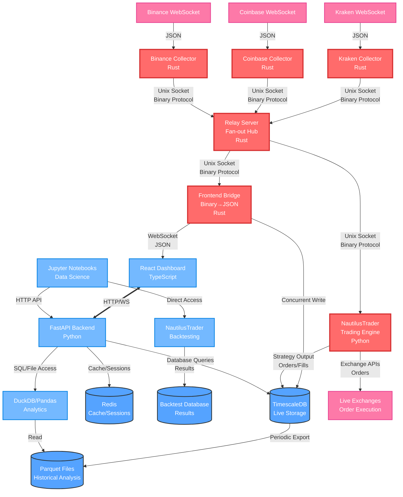

# Low-Latency Trading System Architecture

## Overview

This system is designed as a high-performance quantitative trading framework that handles real-time market data with microsecond-level latency while providing robust APIs for portfolio management and data analysis. The architecture separates concerns into distinct performance tiers, ensuring that critical market data flows through optimized paths while less time-sensitive operations use more conventional web technologies.

The core principle driving this design is the recognition that different types of data and operations have vastly different latency requirements. Live market data streaming requires sub-20 microsecond response times, while user authentication or portfolio queries can tolerate millisecond latencies without impact. This separation allows each component to be optimized for its specific use case.

## System Architecture Diagram



## Performance Tiers

The system operates on three distinct performance tiers, each optimized for different latency and throughput requirements.

### Hot Path (Microsecond Performance)

The hot path handles live market data streaming where every microsecond matters. This tier consists entirely of Rust services communicating through Unix domain sockets, chosen specifically for their minimal overhead and predictable performance characteristics. Market data flows from exchange WebSocket connections through binary protocol conversion, gets multiplexed across multiple exchanges, and arrives at the frontend with total latency typically under 35 microseconds.

The binary protocol used internally is designed for zero-copy operations wherever possible. Trade messages are fixed at 48 bytes total, allowing for predictable parsing performance and efficient memory layout. Price and volume data uses fixed-point arithmetic to avoid floating-point precision issues that can plague financial applications.

### Warm Path (Millisecond Performance)

The warm path serves the traditional web application needs like user authentication, portfolio management, and dashboard APIs. This tier uses FastAPI with Python, providing rapid development capabilities and excellent integration with the broader Python ecosystem. Response times in the 1-100 millisecond range are perfectly acceptable for these operations.

FastAPI also serves the compiled React frontend files, acting as both the API backend and the static file server. This simplifies deployment while keeping the architecture clean. Redis provides caching and session management, ensuring that frequently accessed data doesn't require database roundtrips.

### Cold Path (Multi-Second Performance)

The cold path handles analytical workloads, report generation, and batch processing where latency is not a concern. This includes historical data analysis, backtesting, and complex portfolio calculations. These operations may take seconds or minutes to complete but provide deep insights into trading performance and market behavior.

## Data Flow Architecture

Market data follows a carefully designed path from exchanges to storage, optimized at each step for both performance and reliability.

### Real-Time Streaming

Exchange WebSocket connections are maintained by dedicated Rust collector services, with one collector per exchange to ensure fault isolation. If Kraken experiences connectivity issues, Coinbase data continues flowing uninterrupted. Each collector converts incoming JSON market data into the optimized binary protocol and writes to dedicated Unix domain sockets.

The relay server acts as the central multiplexing hub, reading from all exchange collector sockets simultaneously and distributing the combined stream to multiple downstream consumers. This includes both the frontend bridge for dashboard display and NautilusTrader for live trading operations. The relay maintains separate sequence numbers per exchange to detect message loss while preserving ordering guarantees.

The frontend bridge converts binary protocol messages back to JSON format for browser consumption while simultaneously writing to TimescaleDB for persistence. This concurrent write ensures that all streaming data is captured for later analysis without impacting real-time delivery performance.

### Live Trading Integration

NautilusTrader receives the same ultra-low latency market data stream through a dedicated Unix socket connection from the relay server. This ensures that trading strategies operate on identical data to what appears on monitoring dashboards, eliminating potential arbitrage between display and execution. NautilusTrader processes this market data through its strategy engine and generates orders that are sent directly to exchange APIs.

All trading activity, including orders, fills, and strategy decisions, gets logged to TimescaleDB for comprehensive audit trails and performance analysis. This creates a complete record of trading operations that can be analyzed alongside market data to evaluate strategy effectiveness.

### Data Persistence Strategy

TimescaleDB serves as the primary storage for live streaming data, chosen for its excellent time-series performance and PostgreSQL compatibility. The database can handle concurrent writes from the streaming pipeline while serving analytical queries from Jupyter notebooks and dashboard components.

Periodically, historical data gets exported to Parquet format for long-term storage and analytical processing. Parquet's columnar format and compression make it ideal for the large-scale historical analysis common in quantitative trading. DuckDB provides fast analytical queries over these Parquet files, often outperforming traditional databases for complex aggregations.

## Component Details

### Rust Services

The three core Rust services form the backbone of the real-time data pipeline. Exchange collectors maintain WebSocket connections with robust reconnection logic and convert market data to the internal binary protocol. The relay server multiplexes streams from multiple exchanges and handles fan-out to consumers including both the frontend bridge and NautilusTrader with lock-free message passing. The frontend bridge converts binary messages to JSON and serves WebSocket clients while writing to the database.

Each Rust service can be independently scaled and optimized. Collectors can be pinned to dedicated CPU cores for consistent performance, while the relay server can leverage multiple cores for parallel processing. All services use Tokio's async runtime for efficient resource utilization.

### FastAPI Backend

The FastAPI service handles all non-latency-critical operations including user authentication, portfolio management, and serving the React frontend. It connects to both Redis for caching and TimescaleDB for persistent data, providing a clean API layer that abstracts database complexity from frontend components.

FastAPI's automatic OpenAPI documentation and async support make it ideal for rapid development of trading-related APIs. The service can easily integrate with existing Python libraries for financial calculations, machine learning, and data analysis.

### NautilusTrader Integration

NautilusTrader serves as the production trading engine, receiving ultra-low latency market data from the relay server and executing trading strategies in real-time. The integration maintains the same performance characteristics as the dashboard data feed, ensuring that trading decisions are based on the freshest available market information.

For development and backtesting, NautilusTrader operates independently of the live data stream, processing historical data from Parquet files through its comprehensive backtesting framework. This allows strategy development and validation without any risk to live trading capital. The backtesting results are stored separately from live trading data, enabling detailed performance comparisons and strategy optimization.

### Frontend Application

The React dashboard connects to both the real-time WebSocket stream and the FastAPI backend through separate connections. This allows ultra-fast market data updates while maintaining responsive user interface interactions for portfolio management and configuration changes.

TypeScript provides type safety for financial data handling, reducing the likelihood of calculation errors that could impact trading decisions. The frontend can subscribe to specific symbols or exchanges through the WebSocket connection, receiving only relevant market data updates.

### Analysis Environment

Jupyter notebooks connect to the system through multiple pathways depending on the analysis type. For live data exploration and monitoring, notebooks access FastAPI endpoints that provide clean, cached access to recent market data and portfolio information. For backtesting and strategy development, notebooks can directly interface with NautilusTrader's backtesting engine, running strategies against historical data stored in Parquet format.

This multi-modal access ensures that data scientists and quantitative analysts have the right tool for each task. Live analysis uses the same APIs as the production dashboard, while backtesting operates in a sandboxed environment with historical data that won't impact live trading operations. NautilusTrader's backtesting results are stored in a separate database, allowing comparison between paper trading results and live performance.

## Key Technologies

**Rust with Tokio** provides the async runtime and performance characteristics needed for microsecond-latency data processing. Unix domain sockets offer the lowest-latency IPC mechanism available on Unix systems, with typical latencies under 10 microseconds for local communication.

**TimescaleDB** extends PostgreSQL with time-series optimizations, providing both real-time write performance and analytical query capabilities. The PostgreSQL compatibility ensures broad tooling support and familiar SQL interfaces.

**Redis** handles caching, session management, and pub/sub messaging for non-critical operations. Its in-memory design provides fast access to frequently used data like symbol mappings and user preferences.

**DuckDB and Parquet** form an efficient analytical stack for historical data processing. DuckDB's vectorized execution engine can process large datasets faster than traditional row-oriented databases, while Parquet's compression reduces storage costs.

## Performance Characteristics

The system targets 15-35 microsecond end-to-end latency for market data delivery, with throughput capacity exceeding 100,000 messages per second per exchange. The relay server can handle aggregate throughput over 1,000,000 messages per second while supporting 10+ concurrent frontend clients.

Memory usage remains predictable through pre-allocated buffers and lock-free data structures. CPU utilization can be controlled through process affinity, ensuring that critical services get dedicated processor time without interference from other system processes.

The architecture scales both vertically and horizontally. Individual services can be optimized for single-core performance, while the overall system can distribute across multiple machines as data volumes grow. The clean separation between hot, warm, and cold paths allows each tier to scale independently based on actual usage patterns.

## Development and Operations

The system supports incremental development and testing. Individual components can be developed and tested in isolation, with the binary protocol serving as a stable interface between services. Mock data generators can replace exchange connections during development, while the modular architecture allows easy addition of new exchanges or data types.

Monitoring and observability are built into each service, with metrics available through HTTP endpoints and structured logging throughout. The system can detect and alert on message loss, connectivity issues, and performance degradation while maintaining operation under adverse conditions.

This architecture provides a solid foundation for quantitative trading operations, balancing ultra-low latency requirements with development productivity and operational reliability.


=============================================
=============================================
=============================================
=============================================
=============================================
=============================================
============== DEPRECATED!! ================
=============================================
=============================================
=============================================
=============================================
=============================================
=============================================


# AlphaPulse

> High-performance quantitative trading platform with event-driven architecture, real-time market data processing, and integrated research environment.

## Overview

AlphaPulse is a hybrid Python/Rust trading system designed for cryptocurrency and equity markets. It combines the performance of Rust for data collection with Python's rich ecosystem for analytics and machine learning.

```
┌─────────────────────────────────────────────────────────────────┐
│                      AlphaPulse Platform                        │
├─────────────────────────────────────────────────────────────────┤
│                                                                 │
│  ┌──────────┐  ┌──────────┐  ┌──────────┐  ┌──────────┐     │
│  │   Home   │  │  Develop │  │ Research │  │ Monitor  │     │
│  │    News  │  │    IDE   │  │  Jupyter │  │  Charts  │     │
│  └──────────┘  └──────────┘  └──────────┘  └──────────┘     │
│                                                                 │
│  ┌───────────────────────────────────────────────────────┐    │
│  │              React + TypeScript Frontend              │    │
│  └───────────────────────────────────────────────────────┘    │
│                            │                                   │
│                            ↓ REST + WebSocket                  │
│  ┌───────────────────────────────────────────────────────┐    │
│  │              FastAPI Backend (Python)                 │    │
│  │  ┌─────────────┐  ┌──────────────┐  ┌─────────────┐ │    │
│  │  │  Services   │  │ Repositories │  │   Analytics │ │    │
│  │  │  Business   │←→│   Data       │  │   Jupyter   │ │    │
│  │  │   Logic     │  │   Access     │  │  Backtests  │ │    │
│  │  └─────────────┘  └──────────────┘  └─────────────┘ │    │
│  └───────────────────────────────────────────────────────┘    │
│                            │                                   │
│  ┌───────────────────────────────────────────────────────┐    │
│  │          Data Collection Layer (Migrating to Rust)    │    │
│  │                                                       │    │
│  │  Exchange → Rust Collectors → TimescaleDB → Parquet  │    │
│  │                                      ↓                │    │
│  │                                   DuckDB              │    │
│  │                                 (Analytics)           │    │
│  └───────────────────────────────────────────────────────┘    │
└─────────────────────────────────────────────────────────────────┘
```

## Architecture

### Data Flow Architecture

```
┌─────────────────────────────────────────────────────────────┐
│                     RESEARCH WORKFLOW                        │
│                                                              │
│  Exchanges          Rust Services        Storage            │
│  ┌────────┐        ┌────────────┐      ┌──────────┐       │
│  │Coinbase│───────→│            │      │TimescaleDB│       │
│  └────────┘   WS   │  Collectors│─────→│  (Buffer) │       │
│  ┌────────┐        │            │      └─────┬────┘       │
│  │ Kraken │───────→│  - Trades  │            │ Batch       │
│  └────────┘        │  - Orders  │            ↓ Export      │
│  ┌────────┐        │  - L2 Book │      ┌──────────┐       │
│  │ Alpaca │───────→│            │      │  Parquet │       │
│  └────────┘        └────────────┘      │   Files  │       │
│                                         └─────┬────┘       │
│                                               ↓             │
│                                         ┌──────────┐       │
│                                         │  DuckDB  │       │
│                                         │(Analytics)│       │
│                                         └──────────┘       │
└─────────────────────────────────────────────────────────────┘

┌─────────────────────────────────────────────────────────────┐
│                     TRADING WORKFLOW                         │
│                                                              │
│  Exchanges        NautilusTrader        Execution           │
│  ┌────────┐      ┌──────────────┐     ┌──────────┐        │
│  │Exchange│─────→│   WebSocket   │────→│ Strategy │        │
│  └────────┘  WS  │   Adapters    │     │  Engine  │        │
│                  └──────────────┘     └─────┬────┘        │
│                                              ↓              │
│                                        ┌──────────┐        │
│                                        │  Orders  │        │
│                                        │   Out    │        │
│                                        └──────────┘        │
└─────────────────────────────────────────────────────────────┘
```

### Service Layer Architecture (Repository Pattern)

```python
# Clean separation enables Python → Rust migration without changing business logic

┌──────────────┐     ┌──────────────┐     ┌──────────────┐
│   FastAPI    │────→│   Service    │────→│ Repository   │
│   Routes     │     │   Layer      │     │  Interface   │
└──────────────┘     └──────────────┘     └──────┬───────┘
                                                  │
                           ┌──────────────────────┼──────────────────────┐
                           ↓                      ↓                      ↓
                    ┌──────────────┐      ┌──────────────┐      ┌──────────────┐
                    │   Python     │      │    Rust      │      │   Mock       │
                    │   Impl       │      │    Impl      │      │   Impl       │
                    │  (Current)   │      │  (Future)    │      │  (Tests)     │
                    └──────────────┘      └──────────────┘      └──────────────┘

# Example: Swapping implementations with feature flags
if settings.USE_RUST_MARKET_DATA:
    repo = RustMarketDataRepo()  # Fast Rust implementation
else:
    repo = PythonMarketDataRepo()  # Current Python implementation
```

## Key Engineering Decisions

### 1. **Hybrid Python/Rust Architecture**

**Decision**: Keep Python for business logic, migrate performance-critical paths to Rust

```
Performance Requirements by Component:

Component               Language    Latency Target    Throughput
─────────────────────────────────────────────────────────────
WebSocket Collectors    Rust        <1ms             10,000 msg/s
Orderbook Processing    Rust        <100μs           100,000 updates/s
Business Logic          Python      <100ms           100 req/s
Analytics/ML            Python      <1s              Batch processing
Jupyter Integration     Python      N/A              Interactive
```

### 2. **Database Strategy: Streaming → Batch → Analytics**

**Decision**: TimescaleDB for streaming buffer, Parquet for storage, DuckDB for analytics

```
┌────────────────────────────────────────────────────────┐
│              Storage Cost & Performance                 │
├────────────────────────────────────────────────────────┤
│                                                        │
│  TimescaleDB (7-day window)                           │
│  ├─ Role: Streaming buffer                            │
│  ├─ Size: ~50GB                                       │
│  └─ Query: <10ms for recent data                      │
│                                                        │
│  Parquet Files (permanent)                            │
│  ├─ Role: Long-term storage                           │
│  ├─ Size: ~5GB (10x compression)                      │
│  └─ Cost: $0.023/GB/month (S3)                        │
│                                                        │
│  DuckDB (in-process)                                  │
│  ├─ Role: Fast analytics                              │
│  ├─ Performance: 100x faster than Postgres            │
│  └─ Location: Runs in Jupyter/Python process          │
└────────────────────────────────────────────────────────┘
```

### 3. **Repository Pattern for Clean Migration**

**Decision**: Abstract data access to enable gradual Python → Rust migration

```python
# Repository interface (unchanged during migration)
class MarketDataRepository(Protocol):
    async def get_trades(self, symbol: str) -> List[Trade]: ...
    async def get_orderbook(self, symbol: str) -> OrderBook: ...

# Service layer (unchanged during migration)
class TradingService:
    def __init__(self, repo: MarketDataRepository):
        self.repo = repo  # Can be Python OR Rust implementation
    
    async def analyze_market(self, symbol: str):
        trades = await self.repo.get_trades(symbol)
        # Business logic remains identical
        return compute_signals(trades)
```

### 4. **Event-Driven Architecture**

**Decision**: All actions logged as events for audit and replay

```
┌─────────────┐     ┌─────────────┐     ┌─────────────┐
│   Action    │────→│    Event    │────→│  Event Log  │
└─────────────┘     └─────────────┘     └─────────────┘
                           │                    │
                           ↓                    ↓
                    ┌─────────────┐     ┌─────────────┐
                    │  Handlers   │     │   Replay    │
                    └─────────────┘     └─────────────┘
```

## Performance Targets

| Metric | Current (Python) | Target (Rust) | Improvement |
|--------|-----------------|---------------|-------------|
| WebSocket Throughput | 1,000 msg/s | 10,000 msg/s | 10x |
| Orderbook Updates | 10,000/s | 100,000/s | 10x |
| Message Latency | 10ms | <1ms | 10x |
| Memory Usage | 2GB | 200MB | 10x |
| Database Writes | 1,000/s | 10,000/s | 10x |

## Tech Stack

### Frontend
- **Framework**: React 18 + TypeScript
- **Build**: Vite
- **Charts**: TradingView Lightweight Charts
- **Editor**: Monaco Editor (VSCode)
- **State**: React Context + Hooks

### Backend (Current)
- **API**: FastAPI (migrating from Flask)
- **Async**: asyncio + aiohttp
- **Database**: SQLAlchemy + Alembic
- **WebSocket**: websockets library
- **Auth**: JWT tokens

### Backend (Future)
- **Performance**: Rust + Tokio
- **WebSocket**: tokio-tungstenite
- **Serialization**: Serde + JSON
- **Database**: tokio-postgres + duckdb-rs

### Data Storage
- **Time-Series**: TimescaleDB (7-day buffer)
- **Analytics**: DuckDB + Parquet files
- **Cache**: Redis
- **Application**: SQLite / PostgreSQL

### Infrastructure
- **Monitoring**: Prometheus + Grafana
- **Tracing**: OpenTelemetry
- **Container**: Docker + docker-compose
- **CI/CD**: GitHub Actions

## Getting Started

### Prerequisites
```bash
# Python 3.8+ (3.13 compatible)
python --version

# Node.js 18+
node --version

# Rust 1.70+ (for future services)
rustc --version
```

### Environment Setup
```bash
# Required environment variables
export ALPACA_API_KEY="your_key"
export ALPACA_API_SECRET="your_secret"
export ALPACA_BASE_URL="https://paper-api.alpaca.markets"
```

### Quick Start
```bash
# Backend
cd backend
pip install -r requirements.txt
python app.py

# Frontend (new terminal)
cd frontend
npm install
npm run dev

# Access at http://localhost:5173
```

## Project Structure

```
alphapulse/
├── backend/
│   ├── api/                 # FastAPI routes
│   ├── services/            # Business logic
│   ├── repositories/        # Data access layer
│   ├── analytics/           # Jupyter, ML, backtesting
│   ├── core/               # Models, schemas, config
│   └── tests/              # Test suite
│
├── frontend/
│   ├── src/
│   │   ├── pages/          # Page components
│   │   ├── components/     # Reusable UI
│   │   └── services/       # API clients
│   └── public/             # Static assets
│
├── rust-services/          # Future Rust services
│   ├── collectors/         # Market data collectors
│   └── streaming/          # WebSocket servers
│
└── docs/                   # Documentation
```

## Migration Status

Currently migrating from Python to Rust for performance-critical components:

| Phase | Status | Timeline | Description |
|-------|--------|----------|-------------|
| Phase 0 | 🟡 In Progress | 4 weeks | Service layer, monitoring setup |
| Phase 1 | ⏳ Pending | 2 weeks | Rust PoC with single collector |
| Phase 2 | ⏳ Pending | 4 weeks | All collectors in Rust |
| Phase 3 | ⏳ Pending | 3 weeks | WebSocket infrastructure |
| Phase 4 | ⏳ Pending | 2 weeks | Production deployment |

## 📈 Roadmap

- [x] FastAPI migration from Flask
- [x] Repository pattern implementation
- [ ] Prometheus + Grafana monitoring
- [ ] Rust trade collector PoC
- [ ] Complete Rust migration
- [ ] NautilusTrader integration
- [ ] Production deployment
- [ ] ML strategy development

## 🤝 Contributing

See [CONTRIBUTING.md](docs/CONTRIBUTING.md) for development guidelines.

## 📄 License

Proprietary - All rights reserved

## 🔗 Links

- [Architecture Documentation](docs/architecture.md)
- [API Documentation](docs/api.md)
- [Rust Migration Plan](rust-migration.md)
- [Deployment Guide](docs/deployment.md)

---

*Built for speed. Designed for scale. Optimized for profit.*
