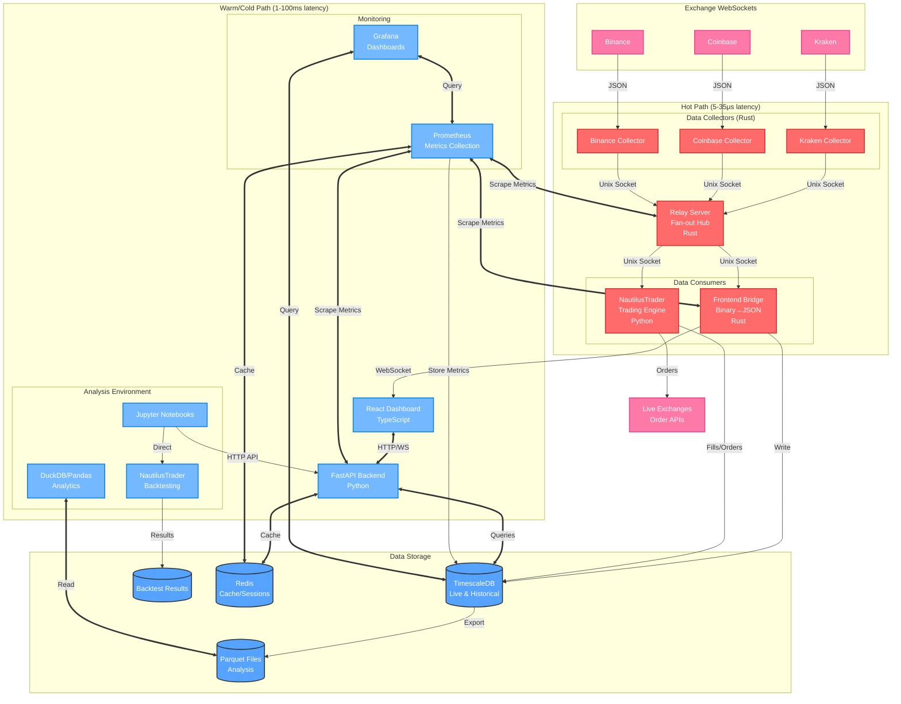

# Low-Latency Trading System Architecture

## Overview

This system is designed as a high-performance quantitative trading framework that handles real-time market data with microsecond-level latency while providing robust APIs for portfolio management and data analysis. The architecture separates concerns into distinct performance tiers, ensuring that critical market data flows through optimized paths while less time-sensitive operations use more conventional web technologies.

The core principle driving this design is the recognition that different types of data and operations have vastly different latency requirements. Live market data streaming requires sub-20 microsecond response times, while user authentication or portfolio queries can tolerate millisecond latencies without impact. This separation allows each component to be optimized for its specific use case.

## System Architecture Diagram



## Performance Tiers

The system operates on three distinct performance tiers, each optimized for different latency and throughput requirements.

### Hot Path (Microsecond Performance)

The hot path handles live market data streaming where every microsecond matters. This tier consists entirely of Rust services communicating through Unix domain sockets, chosen specifically for their minimal overhead and predictable performance characteristics. Market data flows from exchange WebSocket connections through binary protocol conversion, gets multiplexed across multiple exchanges, and arrives at the frontend with total latency typically under 35 microseconds.

The binary protocol used internally is designed for zero-copy operations wherever possible. Trade messages are fixed at 48 bytes total, allowing for predictable parsing performance and efficient memory layout. Price and volume data uses fixed-point arithmetic to avoid floating-point precision issues that can plague financial applications.

### Warm Path (Millisecond Performance)

The warm path serves the traditional web application needs like user authentication, portfolio management, and dashboard APIs. This tier uses FastAPI with Python, providing rapid development capabilities and excellent integration with the broader Python ecosystem. Response times in the 1-100 millisecond range are perfectly acceptable for these operations.

FastAPI also serves the compiled React frontend files, acting as both the API backend and the static file server. This simplifies deployment while keeping the architecture clean. Redis provides caching and session management, ensuring that frequently accessed data doesn't require database roundtrips.

### Cold Path (Multi-Second Performance)

The cold path handles analytical workloads, report generation, and batch processing where latency is not a concern. This includes historical data analysis, backtesting, and complex portfolio calculations. These operations may take seconds or minutes to complete but provide deep insights into trading performance and market behavior.

## Data Flow Architecture

Market data follows a carefully designed path from exchanges to storage, optimized at each step for both performance and reliability.

### Real-Time Streaming

Exchange WebSocket connections are maintained by dedicated Rust collector services, with one collector per exchange to ensure fault isolation. If Kraken experiences connectivity issues, Coinbase data continues flowing uninterrupted. Each collector converts incoming JSON market data into the optimized binary protocol and writes to dedicated Unix domain sockets.

The relay server acts as the central multiplexing hub, reading from all exchange collector sockets simultaneously and distributing the combined stream to multiple downstream consumers. This includes both the frontend bridge for dashboard display and NautilusTrader for live trading operations. The relay maintains separate sequence numbers per exchange to detect message loss while preserving ordering guarantees.

The frontend bridge converts binary protocol messages back to JSON format for browser consumption while simultaneously writing to TimescaleDB for persistence. This concurrent write ensures that all streaming data is captured for later analysis without impacting real-time delivery performance.

### Live Trading Integration

NautilusTrader receives the same ultra-low latency market data stream through a dedicated Unix socket connection from the relay server. This ensures that trading strategies operate on identical data to what appears on monitoring dashboards, eliminating potential arbitrage between display and execution. NautilusTrader processes this market data through its strategy engine and generates orders that are sent directly to exchange APIs.

All trading activity, including orders, fills, and strategy decisions, gets logged to TimescaleDB for comprehensive audit trails and performance analysis. This creates a complete record of trading operations that can be analyzed alongside market data to evaluate strategy effectiveness.

### Data Persistence Strategy

TimescaleDB serves as the primary storage for live streaming data, chosen for its excellent time-series performance and PostgreSQL compatibility. The database can handle concurrent writes from the streaming pipeline while serving analytical queries from Jupyter notebooks and dashboard components.

Periodically, historical data gets exported to Parquet format for long-term storage and analytical processing. Parquet's columnar format and compression make it ideal for the large-scale historical analysis common in quantitative trading. DuckDB provides fast analytical queries over these Parquet files, often outperforming traditional databases for complex aggregations.

## Component Details

### Rust Services

The three core Rust services form the backbone of the real-time data pipeline. Exchange collectors maintain WebSocket connections with robust reconnection logic and convert market data to the internal binary protocol. The relay server multiplexes streams from multiple exchanges and handles fan-out to consumers including both the frontend bridge and NautilusTrader with lock-free message passing. The frontend bridge converts binary messages to JSON and serves WebSocket clients while writing to the database.

Each Rust service can be independently scaled and optimized. Collectors can be pinned to dedicated CPU cores for consistent performance, while the relay server can leverage multiple cores for parallel processing. All services use Tokio's async runtime for efficient resource utilization.

### FastAPI Backend

The FastAPI service handles all non-latency-critical operations including user authentication, portfolio management, and serving the React frontend. It connects to both Redis for caching and TimescaleDB for persistent data, providing a clean API layer that abstracts database complexity from frontend components.

FastAPI's automatic OpenAPI documentation and async support make it ideal for rapid development of trading-related APIs. The service can easily integrate with existing Python libraries for financial calculations, machine learning, and data analysis. It also exposes Prometheus metrics endpoints for monitoring API performance and business metrics.

### Monitoring and Observability

Prometheus collects metrics from all system components, including the Rust services, FastAPI backend, and NautilusTrader. It uses Redis for caching metric metadata and stores time-series data in TimescaleDB for long-term retention and analysis. This creates a comprehensive monitoring system that can track both technical performance metrics and business KPIs.

Grafana provides visualization dashboards for system monitoring, trading performance analysis, and business intelligence. It queries both Prometheus for real-time metrics and TimescaleDB directly for historical analysis, enabling operators to understand system behavior across multiple time horizons.

### NautilusTrader Integration

NautilusTrader serves as the production trading engine, receiving ultra-low latency market data from the relay server and executing trading strategies in real-time. The integration maintains the same performance characteristics as the dashboard data feed, ensuring that trading decisions are based on the freshest available market information.

For development and backtesting, NautilusTrader operates independently of the live data stream, processing historical data from Parquet files through its comprehensive backtesting framework. This allows strategy development and validation without any risk to live trading capital. The backtesting results are stored separately from live trading data, enabling detailed performance comparisons and strategy optimization.

### Frontend Application

The React dashboard connects to both the real-time WebSocket stream and the FastAPI backend through separate connections. This allows ultra-fast market data updates while maintaining responsive user interface interactions for portfolio management and configuration changes.

TypeScript provides type safety for financial data handling, reducing the likelihood of calculation errors that could impact trading decisions. The frontend can subscribe to specific symbols or exchanges through the WebSocket connection, receiving only relevant market data updates.

### Analysis Environment

Jupyter notebooks connect to the system through multiple pathways depending on the analysis type. For live data exploration and monitoring, notebooks access FastAPI endpoints that provide clean, cached access to recent market data and portfolio information. For backtesting and strategy development, notebooks can directly interface with NautilusTrader's backtesting engine, running strategies against historical data stored in Parquet format.

This multi-modal access ensures that data scientists and quantitative analysts have the right tool for each task. Live analysis uses the same APIs as the production dashboard, while backtesting operates in a sandboxed environment with historical data that won't impact live trading operations. NautilusTrader's backtesting results are stored in a separate database, allowing comparison between paper trading results and live performance.

## Key Technologies

**Rust with Tokio** provides the async runtime and performance characteristics needed for microsecond-latency data processing. Unix domain sockets offer the lowest-latency IPC mechanism available on Unix systems, with typical latencies under 10 microseconds for local communication.

**TimescaleDB** extends PostgreSQL with time-series optimizations, providing both real-time write performance and analytical query capabilities. The PostgreSQL compatibility ensures broad tooling support and familiar SQL interfaces. It serves as the primary storage for market data, trading records, and monitoring metrics.

**Redis** handles caching, session management, and pub/sub messaging for non-critical operations. Its in-memory design provides fast access to frequently used data like symbol mappings, user preferences, and Prometheus metric caches.

**Prometheus and Grafana** form the monitoring stack, with Prometheus collecting metrics from all services and Grafana providing visualization dashboards. This combination enables real-time monitoring of both system performance and trading operations.

**DuckDB and Parquet** form an efficient analytical stack for historical data processing. DuckDB's vectorized execution engine can process large datasets faster than traditional row-oriented databases, while Parquet's compression reduces storage costs.

## Performance Characteristics

The system targets 15-35 microsecond end-to-end latency for market data delivery, with throughput capacity exceeding 100,000 messages per second per exchange. The relay server can handle aggregate throughput over 1,000,000 messages per second while supporting 10+ concurrent frontend clients.

Memory usage remains predictable through pre-allocated buffers and lock-free data structures. CPU utilization can be controlled through process affinity, ensuring that critical services get dedicated processor time without interference from other system processes.

The architecture scales both vertically and horizontally. Individual services can be optimized for single-core performance, while the overall system can distribute across multiple machines as data volumes grow. The clean separation between hot, warm, and cold paths allows each tier to scale independently based on actual usage patterns.

## Development and Operations

The system supports incremental development and testing. Individual components can be developed and tested in isolation, with the binary protocol serving as a stable interface between services. Mock data generators can replace exchange connections during development, while the modular architecture allows easy addition of new exchanges or data types.

Monitoring and observability are built into each service, with metrics available through HTTP endpoints and structured logging throughout. The system can detect and alert on message loss, connectivity issues, and performance degradation while maintaining operation under adverse conditions.

This architecture provides a solid foundation for quantitative trading operations, balancing ultra-low latency requirements with development productivity and operational reliability.

## Project Structure

```
alphapulse/
├── README.md                           # Main project documentation
├── docker-compose.yml                  # Local development environment
├── .env.example                        # Environment variables template
├── Makefile                            # Build and deployment shortcuts
│
├── rust-services/                      # Hot path Rust services
│   ├── Cargo.toml                      # Workspace configuration
│   ├── protocol/                       # Shared binary protocol definitions
│   │   ├── Cargo.toml
│   │   └── src/
│   │       ├── lib.rs                  # Protocol types and serialization
│   │       ├── message.rs              # Message format definitions
│   │       └── symbol.rs               # Symbol ID mapping
│   │
│   ├── exchange-collectors/            # Per-exchange data collectors
│   │   ├── Cargo.toml
│   │   └── src/
│   │       ├── main.rs                 # Multi-exchange launcher
│   │       ├── config.rs               # Configuration management
│   │       ├── exchanges/
│   │       │   ├── mod.rs
│   │       │   ├── kraken.rs           # Kraken WebSocket client
│   │       │   ├── coinbase.rs         # Coinbase WebSocket client
│   │       │   └── binance.rs          # Binance WebSocket client
│   │       └── unix_socket.rs          # Unix socket writer
│   │
│   ├── relay-server/                   # Central message relay
│   │   ├── Cargo.toml
│   │   └── src/
│   │       ├── main.rs                 # Relay server entry point
│   │       ├── multiplexer.rs          # Multi-input stream handling
│   │       ├── fanout.rs               # Consumer management
│   │       └── metrics.rs              # Performance monitoring
│   │
│   └── frontend-bridge/                # WebSocket bridge to frontend
│       ├── Cargo.toml
│       └── src/
│           ├── main.rs                 # Bridge server entry point
│           ├── websocket.rs            # WebSocket server
│           ├── protocol_converter.rs   # Binary to JSON conversion
│           └── database.rs             # TimescaleDB writer
│
├── python-backend/                     # Warm/cold path Python services
│   ├── requirements.txt                # Python dependencies
│   ├── pyproject.toml                  # Python project configuration
│   ├── app/
│   │   ├── __init__.py
│   │   ├── main.py                     # FastAPI application entry
│   │   ├── config.py                   # Configuration management
│   │   ├── dependencies.py             # Dependency injection
│   │   │
│   │   ├── api/                        # API route definitions
│   │   │   ├── __init__.py
│   │   │   ├── auth.py                 # Authentication endpoints
│   │   │   ├── portfolio.py            # Portfolio management
│   │   │   ├── market_data.py          # Historical market data
│   │   │   └── trading.py              # Trading interface
│   │   │
│   │   ├── models/                     # Database models
│   │   │   ├── __init__.py
│   │   │   ├── user.py
│   │   │   ├── portfolio.py
│   │   │   └── market_data.py
│   │   │
│   │   ├── services/                   # Business logic
│   │   │   ├── __init__.py
│   │   │   ├── auth_service.py
│   │   │   ├── portfolio_service.py
│   │   │   └── market_data_service.py
│   │   │
│   │   └── database/                   # Database configuration
│   │       ├── __init__.py
│   │       ├── connection.py           # Database connections
│   │       └── migrations/             # Database migrations
│   │
│   └── tests/                          # Python tests
│       ├── __init__.py
│       ├── test_api/
│       └── test_services/
│
├── nautilus-integration/               # NautilusTrader configuration
│   ├── config/
│   │   ├── strategies/                 # Trading strategy configurations
│   │   ├── adapters/                   # Exchange adapter configs
│   │   └── system.json                 # System configuration
│   ├── strategies/                     # Custom trading strategies
│   │   ├── __init__.py
│   │   └── example_strategy.py
│   ├── adapters/                       # Custom exchange adapters
│   │   ├── __init__.py
│   │   └── alphapulse_adapter.py       # Adapter for our data feed
│   └── backtests/                      # Backtesting scripts and results
│       ├── scripts/
│       └── results/
│
├── frontend/                           # React dashboard
│   ├── package.json
│   ├── tsconfig.json
│   ├── tailwind.config.js
│   ├── public/
│   │   └── index.html
│   ├── src/
│   │   ├── index.tsx                   # Application entry point
│   │   ├── App.tsx                     # Main application component
│   │   ├── components/                 # Reusable UI components
│   │   │   ├── Dashboard/
│   │   │   ├── Charts/
│   │   │   ├── Portfolio/
│   │   │   └── Trading/
│   │   ├── services/                   # Frontend services
│   │   │   ├── WebSocketService.ts     # Real-time data connection
│   │   │   ├── ApiService.ts           # HTTP API client
│   │   │   └── AuthService.ts          # Authentication
│   │   ├── hooks/                      # Custom React hooks
│   │   ├── types/                      # TypeScript type definitions
│   │   └── utils/                      # Utility functions
│   └── build/                          # Production build output
│
├── notebooks/                          # Jupyter analysis notebooks
│   ├── requirements.txt                # Analysis dependencies
│   ├── data_exploration/
│   │   ├── market_analysis.ipynb
│   │   └── portfolio_performance.ipynb
│   ├── strategy_development/
│   │   ├── backtesting.ipynb
│   │   └── signal_analysis.ipynb
│   └── research/
│       ├── market_microstructure.ipynb
│       └── risk_analysis.ipynb
│
├── infrastructure/                     # Deployment and infrastructure
│   ├── docker/
│   │   ├── rust-services.Dockerfile
│   │   ├── python-backend.Dockerfile
│   │   ├── frontend.Dockerfile
│   │   └── jupyter.Dockerfile
│   └── monitoring/                     # Observability configuration
│       └── prometheus.yml
│
├── data/                               # Local data storage
│   ├── timescaledb/                    # Database data
│   ├── redis/                          # Redis data
│   ├── parquet/                        # Exported data files
│   │   ├── market_data/
│   │   └── trading_results/
│   └── logs/                           # Application logs
│
├── scripts/                            # Utility scripts
│   ├── setup.sh                       # Development environment setup
│   ├── build.sh                       # Build all services
│   ├── deploy.sh                      # Deployment script
│   └── data_export.py                 # Data export utilities
│
├── tests/                              # Integration tests
│   ├── integration/
│   │   ├── test_data_pipeline.py
│   │   └── test_end_to_end.py
│   ├── performance/
│   │   ├── latency_tests.rs
│   │   └── throughput_tests.py
│   └── fixtures/                       # Test data and mocks
│
└── docs/                               # Documentation
    ├── architecture.md                 # System architecture
    ├── api/                            # API documentation
    ├── deployment.md                   # Deployment guide
    ├── development.md                  # Development setup
    └── performance.md                  # Performance characteristics
```

### Organizational Principles

**Language Separation**: Each major technology stack gets its own top-level directory with appropriate tooling and conventions. Rust services use Cargo workspaces, Python uses standard package structure, and frontend follows React best practices.

**Service Boundaries**: Services are organized by performance tier and responsibility rather than by technology. Hot path services are separate from warm path services, making it easy to optimize and scale each independently.

**Configuration Management**: Environment-specific configuration is centralized but service-specific configs stay with their services. This allows independent deployment while maintaining consistency.

**Data Organization**: Local data storage is organized by type and lifecycle, making it easy to manage retention policies and export processes.

### Development Workflow

**Build and Test**: Each service has its own build process but can be orchestrated through the root Makefile. Integration tests verify end-to-end functionality while unit tests stay with their respective services.

**Local Development**: Docker Compose provides a complete local environment including databases and external service mocks. Each service can also run independently for focused development.

**Deployment**: Docker containers provide consistent deployment across environments. The infrastructure directory contains deployment configurations and monitoring setup for production environments.
