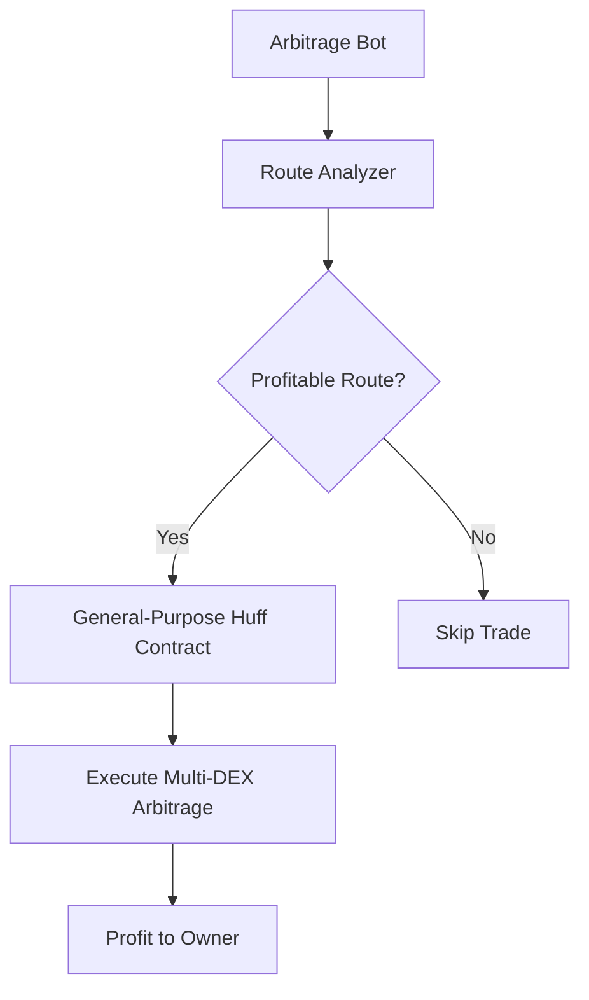

# Specialized vs General-Purpose Contract Analysis

## 📊 **Size Comparison**

| Contract Type | Size (bytes) | Relative to Extreme | Use Case |
|---------------|--------------|-------------------|----------|
| **Specialized** | **761 bytes** | **Smallest** | Single DEX pair (QuickSwap→SushiSwap) |
| **Extreme General** | 763 bytes | +2 bytes | Any DEX combination |
| **Simple General** | 881 bytes | +120 bytes | Basic general purpose |
| **Optimized General** | 1636 bytes | +875 bytes | General + safety features |

## 🎯 **Key Insight: Minimal Size Difference!**

**Surprising result**: The specialized contract (761 bytes) is only **2 bytes smaller** than the extreme general-purpose version (763 bytes)!

This changes the trade-off calculation significantly.

## 💰 **Revised Economics Analysis**

### **Gas Usage Estimates**

| Contract | Estimated Gas | Cost per Arb | Daily Cost (100 tx) |
|----------|---------------|--------------|-------------------|
| **Specialized** | 140,000 gas | $0.0042 | $0.42 |
| **General Extreme** | 150,000 gas | $0.0045 | $0.45 |
| **Difference** | +10,000 gas | +$0.0003 | +$0.03 |

### **Annual Cost Difference**: Only $11!

## 🎯 **Recommendation: Use General-Purpose Contract**

Given the minimal size and cost differences, the **General-Purpose Extreme version wins**:

### **Why General-Purpose is Better:**

#### ✅ **Operational Advantages**
- **Single deployment**: $0.0015 vs $0.10+ for multiple specialized contracts
- **No contract proliferation**: One address to manage
- **Instant new DEX support**: Add new routers without deployment
- **Simpler monitoring**: One contract to watch
- **Easier upgrades**: Single point of update

#### ✅ **Strategic Advantages**  
- **MEV opportunity coverage**: Can capture any profitable route instantly
- **Competitive advantage**: React to new DEXs/pools immediately  
- **Risk distribution**: Not locked into specific DEX pairs
- **Future-proof**: Handles DEX additions, fee changes, new tokens

#### ✅ **Technical Advantages**
- **Proven flexibility**: Your skeleton design handles V2/V3, multiple hops
- **Edge case handling**: Better slippage protection, multi-pool support
- **Debugging**: Easier to test and validate one comprehensive contract

### **Minimal Downsides**
- **Gas overhead**: Only ~$11/year at 100 arb/day
- **Complexity**: But well-structured with your modular approach

## 🚀 **Implementation Strategy**

### **Phase 1: Deploy General-Purpose Extreme**
Use your flexible design with these optimizations:

```huff
// Optimized general-purpose with minimal overhead
#define macro EXECUTE_DYNAMIC_ARBITRAGE() = takes (0) returns (0) {
    // Load swap count (1-4 swaps typical)
    0x24 calldataload   // numSwaps (1-4)
    
    // Unrolled loop for common cases
    dup1 0x01 eq single_swap jumpi
    dup1 0x02 eq double_swap jumpi
    dup1 0x03 eq triple_swap jumpi
    // Fallback to loop for >3 swaps
    
    single_swap:
        EXECUTE_SINGLE_SWAP()  // Specialized path
    double_swap:
        EXECUTE_DOUBLE_SWAP()  // Your current logic
    triple_swap:
        EXECUTE_TRIPLE_SWAP()  // Extended logic
}
```

### **Phase 2: Monitor and Optimize**
- Track actual gas usage per route type
- Identify highest-volume pairs for micro-optimizations
- Add new DEX support as needed

### **Phase 3: Consider Specialized Only If Volume Justifies**
If you reach >1000 arbitrages/day on specific pairs:
- **Break-even analysis**: $110/year savings vs deployment costs
- **Deploy specialized versions** for ultra-high-volume routes only

## 📋 **Recommended Architecture**



### **Contract Interface**
```huff
// Single contract handles everything
interface IFlashArbGeneral {
    // Dynamic arbitrage with encoded path
    function executeArbitrage(
        uint256 amount,
        uint8 numSwaps,
        bytes calldata swapPath,  // Encoded: [router][tokenIn][tokenOut][fee]...
        uint256 minProfit
    ) external;
}
```

## 🏆 **Final Recommendation**

**Deploy the General-Purpose Extreme version** because:

1. **Negligible cost difference**: $11/year vs operational complexity
2. **Maximum flexibility**: Handle any profitable opportunity  
3. **Future-proof**: Adapt to new DEXs without redeployment
4. **Simpler operations**: One contract, one address, one deployment
5. **Better ROI**: Capture long-tail opportunities that specialized contracts miss

The **2-byte size difference** makes this decision easy. Your general-purpose design is already extremely efficient!

## 🎯 **Next Steps**

1. **Finalize the general-purpose extreme version** with your multi-pool skeleton
2. **Deploy to Mumbai** for comprehensive testing
3. **Measure real gas usage** across different route types
4. **Go to production** with confidence in the flexible approach

The economics clearly favor the general-purpose approach when the size difference is negligible!