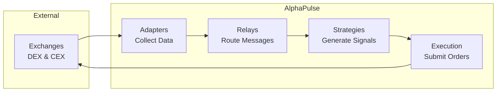

# AlphaPulse Backend V2

> **High-performance cryptocurrency trading system built on clean three-layer architecture**

## 🚀 Quick Start

```bash
# Prerequisites
rustc --version  # Requires 1.75+
python --version # Requires 3.10+
node --version   # Requires 18+

# Start system
./scripts/manage.sh up

# Check status
./scripts/manage.sh status

# View logs
./scripts/manage.sh logs

# Stop system
./scripts/manage.sh down
```

## 📊 Key Metrics

- **Throughput**: >1M messages/second
- **Latency**: <35μs hot path
- **Precision**: Zero loss (native token precision preserved)
- **Protocol**: Custom TLV with 32-byte headers

## 🏗️ Architecture Overview

The system follows a strict **three-layer architecture**:

1. **Data Layer** (`libs/types/`) - Pure data structures
2. **Rules Layer** (`libs/alphapulse_codec/`) - Protocol logic  
3. **Behavior Layer** (Services, Relays) - Active components



**For detailed architecture documentation, see [ARCHITECTURE.md](ARCHITECTURE.md)**

## 📁 Project Structure

```
backend_v2/
├── libs/              # Foundation libraries
│   ├── types/         # Data structures (TradeTLV, etc.)
│   └── alphapulse_codec/ # Protocol implementation
├── services_v2/       # Business logic
│   ├── adapters/      # Exchange connections
│   └── strategies/    # Trading algorithms
├── relays/            # Message distribution
└── scripts/           # System management
    └── manage.sh      # Control interface
```

## 🛠️ Development

### Adding an Exchange Adapter
```bash
# Create adapter structure
mkdir -p services_v2/adapters/new_exchange
cd services_v2/adapters/new_exchange

# Implement adapter following pattern
cargo init --lib
# See services_v2/adapters/polygon_dex for example
```

### Creating a TLV Type
```rust
// 1. Define in libs/types/src/protocol/tlv/
pub struct NewTLV {
    pub field1: u64,
    pub field2: i64,
}

// 2. Register in libs/alphapulse_codec/src/tlv_types.rs
TLVType::NewType = 15,  // Assign number in correct range
```

### Running Tests
```bash
# Unit tests
cargo test --workspace

# Integration tests
cargo test --package tests

# Performance benchmarks
cargo bench
```

## 📚 Documentation

| Document | Description |
|----------|------------|
| [ARCHITECTURE.md](ARCHITECTURE.md) | Complete system architecture |
| [docs/ARCHITECTURE_DETAILS.md](docs/ARCHITECTURE_DETAILS.md) | Technical deep dive |
| [docs/protocol.md](docs/protocol.md) | Protocol V2 specification |
| [CONTRIBUTING.md](CONTRIBUTING.md) | Development guidelines |
| [CLAUDE.md](CLAUDE.md) | AI assistant context |

## 🔒 Security

- **Network**: Unix sockets for local IPC, TLS for external
- **Data**: Checksums prevent corruption, native precision preserved
- **Operations**: Process isolation, graceful degradation

## 📈 Performance

Measured on commodity hardware (Intel i7, 16GB RAM):

| Operation | Rate | Latency |
|-----------|------|---------|
| Message Build | 1.09M/s | 0.9μs |
| Message Parse | 1.64M/s | 0.6μs |
| E2E Hot Path | 850K/s | 35μs |

## 🤝 Contributing

See [CONTRIBUTING.md](CONTRIBUTING.md) for guidelines.

## 📄 License

Proprietary - See [LICENSE](LICENSE) for details.

---

*Built with precision for professional cryptocurrency trading*