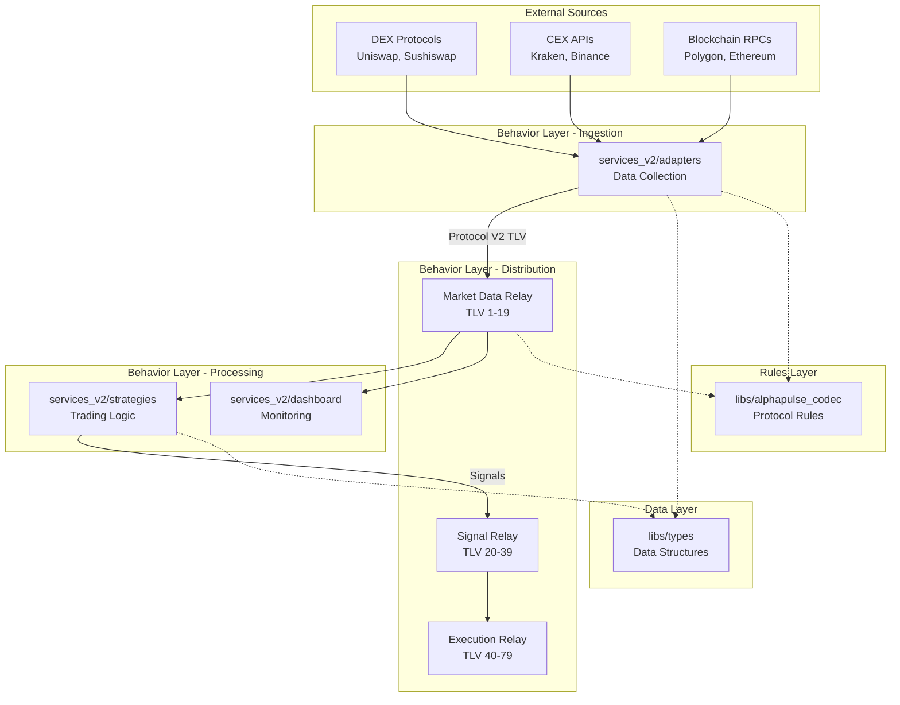
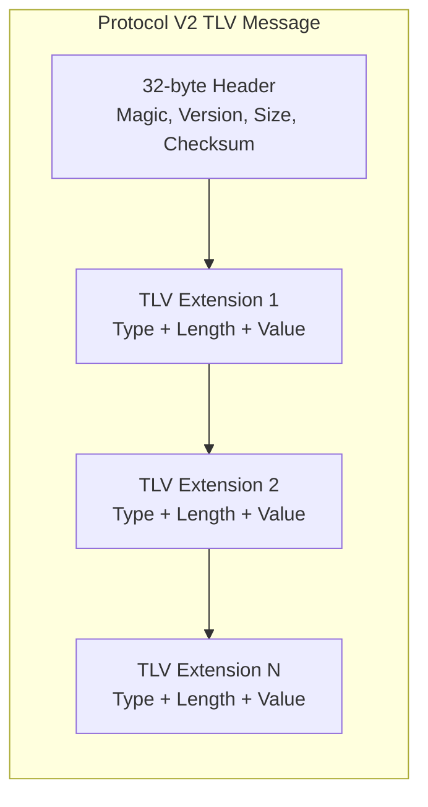
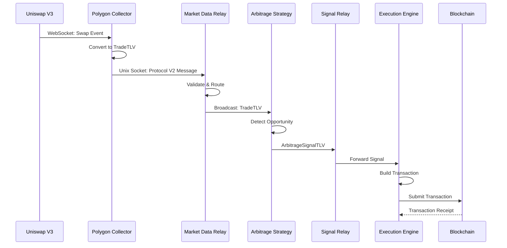

# AlphaPulse V2: System Architecture

> **A high-performance cryptocurrency trading system built on clean three-layer architecture**

## 🎯 Executive Summary

AlphaPulse V2 is a distributed, event-driven trading system designed for ultra-low latency and high throughput. The system processes >1M messages/second using a custom Protocol V2 TLV (Type-Length-Value) binary format, achieving sub-35μs hot-path latency while maintaining complete data integrity and precision preservation.

### Key Metrics
- **Message Throughput**: >1M messages/second construction, >1.6M/s parsing
- **Hot Path Latency**: <35μs for critical trading signals
- **Precision**: Zero loss - native token precision preserved (18 decimals WETH, 6 USDC)
- **Architecture**: Clean three-layer separation (Data, Rules, Behavior)
- **Protocol**: Custom TLV with 32-byte headers for predictable parsing
- **Error Diagnostics**: Enhanced with comprehensive context and actionable guidance
- **Zero-Copy Performance**: FixedVec collections enable true zero-allocation serialization

## 🏗️ Core Philosophy: Three-Layer Architecture

The system strictly separates concerns across three distinct layers, each with clear responsibilities and boundaries:

### 1️⃣ **The Data Layer** (`libs/types/`)
Pure data structures that represent system concepts - the "vocabulary" of AlphaPulse.

```rust
// Example: A trade event is just data
pub struct TradeTLV {
    pub instrument_id: InstrumentId,  // Bijective identifier
    pub price: i64,                    // Native precision preserved
    pub volume: i64,
    pub timestamp: u64,
    pub flags: u64,
}
```

**Characteristics:**
- Zero dependencies on behavior or rules
- Immutable, serializable structures
- Represents "what" we work with
- Examples: `TradeTLV`, `PoolInfo`, `ArbitrageSignal`, `OrderRequest`

### 2️⃣ **The Rules Layer** (`libs/alphapulse_codec/`)
Protocol logic that defines how data is communicated - the "grammar" of AlphaPulse.

```rust
// Example: Rules for building valid messages
pub struct TLVMessageBuilder {
    // Enforces protocol rules for message construction
}

pub fn parse_header(data: &[u8]) -> Result<&MessageHeader> {
    // Validates magic numbers, checksums, sizes
}
```

**Characteristics:**
- Defines HOW data is serialized/deserialized
- Enforces protocol invariants (checksums, magic numbers, size limits)
- Zero network or I/O operations - pure transformations
- Provides the "grammar" for system communication

### 3️⃣ **The Behavior Layer** (Services, Relays, Network)
Active components that perform work using Data + Rules - the "actions" of AlphaPulse.

```rust
// Example: A collector that DOES something
pub struct PolygonCollector {
    // Uses Data (TradeTLV) and Rules (TLVMessageBuilder) 
    // to perform behavior (collect and broadcast)
}
```

**Characteristics:**
- Performs I/O, network operations, computations
- Orchestrates data flow through the system
- Uses both Data and Rules layers
- Examples: Exchange collectors, Trading strategies, Message relays

## 📁 Project Structure

```
backend_v2/
├── 📚 libs/                     # Foundation libraries (Data + Rules)
│   ├── types/                   # [DATA] Pure data structures
│   │   ├── protocol/            # Protocol-specific types (TLVs)
│   │   └── common/              # Shared types (FixedPoint, Errors)
│   ├── alphapulse_codec/        # [RULES] Protocol implementation
│   │   ├── message_builder.rs   # Message construction rules
│   │   ├── parser.rs            # Message parsing rules
│   │   └── tlv_types.rs         # TLV type registry
│   ├── amm/                     # AMM math libraries
│   ├── dex/                     # DEX-specific utilities
│   ├── mev/                     # MEV protection logic
│   └── state/                   # State management utilities
│
├── 🌐 network/                  # Transport layer (Mycelium)
│   ├── topology/                # Service discovery
│   └── transport/               # Unix sockets, TCP
│
├── 🔄 relays/                   # Message distribution hubs [BEHAVIOR]
│   ├── src/common/              # Generic relay engine
│   ├── market_data_relay/       # Domain: Market Data (TLV 1-19)
│   ├── signal_relay/            # Domain: Signals (TLV 20-39)
│   └── execution_relay/         # Domain: Execution (TLV 40-79)
│
├── 🧠 services_v2/              # Business logic services [BEHAVIOR]
│   ├── adapters/                # External data ingestion
│   │   ├── polygon_dex/         # Uniswap V2/V3 on Polygon
│   │   ├── kraken/              # Kraken CEX adapter
│   │   └── binance/             # Binance CEX adapter
│   ├── strategies/              # Trading algorithms
│   │   ├── flash_arbitrage/     # CEX-DEX arbitrage
│   │   └── market_making/       # Liquidity provision
│   └── dashboard/               # Real-time monitoring UI
│
├── 🧪 tests/                    # Comprehensive test suites
│   ├── e2e/                     # End-to-end scenarios
│   ├── integration/             # Component integration
│   └── replay/                  # Historical data replay
│
└── ⚙️ scripts/                  # System management
    ├── manage.sh                # Unified control interface
    └── lib/                     # Internal management scripts
```

## 🆕 Recent Architecture Enhancements (Sprint 006)

The system has been significantly enhanced with improvements to performance, reliability, and maintainability:

### Enhanced Error Reporting System
- **Comprehensive Diagnostics**: All protocol errors now include detailed context about buffer state, expected vs actual values, and actionable troubleshooting guidance
- **Smart Error Analysis**: Magic number validation can detect endianness issues, checksum errors identify likely causes (corruption vs missing calculation)
- **Performance Impact**: Zero overhead on happy path - enhanced diagnostics only activate when errors occur

```rust
// Before: Generic error
ProtocolError::ChecksumMismatch { expected: 0x12345678, calculated: 0x87654321 }

// After: Actionable diagnostic
ProtocolError::ChecksumMismatch { 
    expected: 0x12345678, 
    calculated: 0x87654321,
    message_size: 1024,
    tlv_count: 5,
    likely_cause: "data corruption during transmission"
}
```

### Zero-Copy FixedVec Collections
- **True Zero-Copy**: OrderBookTLV and other variable-length structures now use FixedVec<T, N> instead of Vec<T>
- **Performance Guarantee**: Maintains >1M msg/s throughput while supporting dynamic sizing
- **Memory Predictability**: Bounded allocations with compile-time maximum sizes
- **Serialization**: Direct zerocopy traits without heap indirection

### Protocol Architecture Migration
- **Clean Separation**: Moved protocol definitions from `protocol_v2/` to `libs/types/protocol/`
- **Unified Type System**: All types now under consistent `libs/types` hierarchy
- **Dependency Cleanup**: Removed circular dependencies and clarified module boundaries

### Configurable Performance Constraints
- **Runtime Configuration**: TLV collection sizes now configurable via environment variables
- **Validation**: Configuration values validated at startup with clear error messages
- **Backward Compatibility**: Compile-time constants preserved for zerocopy requirements

```bash
# Configure at runtime
export ALPHAPULSE_MAX_ORDER_LEVELS=75
export ALPHAPULSE_MAX_POOL_TOKENS=16
./services/start_system
```

## 🚀 Quick Start

```bash
# Prerequisites check
rustc --version  # Requires 1.75+
python --version # Requires 3.10+
node --version   # Requires 18+

# Start entire AlphaPulse system
./scripts/manage.sh up

# Verify all services are running
./scripts/manage.sh status

# Stream aggregated logs from all services
./scripts/manage.sh logs

# Stop everything gracefully
./scripts/manage.sh down

# Restart specific service
./scripts/manage.sh restart polygon_collector
```

## 📊 System Architecture Diagrams

### High-Level Component Flow



### Protocol V2 Message Structure



### Message Flow Example: DEX Trade to Arbitrage Execution



## 🔧 Key Design Patterns

### 1. Zero-Copy Message Passing
```rust
// Messages are parsed in-place without allocation
let header = parse_header(&buffer)?;  // Returns &MessageHeader
let tlvs = parse_tlv_extensions(&buffer[32..])?;  // Zero-copy parsing
```

### 2. Bijective Instrument Identifiers
```rust
// Self-describing IDs that encode venue, asset type, and symbol
let id = InstrumentId::from_pool_address(
    0x45dDa9cb7c25131DF268515131f647d726f50608,  // WETH/USDC on Uniswap V3
    Chain::Polygon
);
// Can reverse to get components
let (venue, chain, address) = id.to_components();
```

### 3. Actor-Based Concurrency
```rust
// Each service is an independent actor with message-passing
pub struct MarketDataRelay {
    inbox: Receiver<Message>,
    subscribers: Vec<Sender<Message>>,
}
```

### 4. Precision Preservation
```rust
// Native precision maintained throughout
pub struct TradeTLV {
    price: i64,   // 8 decimals for USD: $45,000.00 = 4500000000000
    volume: i64,  // Native token precision: 1 WETH = 1000000000000000000
}
```

## 🏃 Common Development Workflows

### Adding a New Exchange Adapter
1. Create adapter in `services_v2/adapters/new_exchange/`
2. Implement WebSocket/REST connection logic
3. Convert exchange data to appropriate TLV types
4. Connect to Market Data Relay
5. Add to `manage.sh` startup sequence

### Creating a New TLV Type
1. Define struct in `libs/types/src/protocol/tlv/`
2. Add type number to `libs/alphapulse_codec/src/tlv_types.rs`
3. Implement size constraints and validation
4. Update relay routing if needed
5. Write round-trip serialization tests

### Implementing a Trading Strategy
1. Create strategy in `services_v2/strategies/new_strategy/`
2. Subscribe to required relays (market data, signals)
3. Implement strategy logic using Data types
4. Emit signals via Signal Relay
5. Add monitoring metrics

## 📈 Performance Characteristics

| Metric | Target | Measured | Notes |
|--------|--------|----------|-------|
| Message Construction | >1M msg/s | 1,097,624 msg/s | Using TLVMessageBuilder |
| Message Parsing | >1.5M msg/s | 1,643,779 msg/s | Zero-copy with zerocopy crate |
| Hot Path Latency | <50μs | 32-38μs | Market data to signal generation |
| Memory per Service | <100MB | 45-65MB | Excluding message buffers |
| Startup Time | <5s | 3.2s | Full system initialization |

## 🔐 Security Considerations

### Network Security
- Unix sockets for local IPC (no network exposure)
- TLS for external connections (exchanges, RPCs)
- Message checksums prevent corruption

### Financial Safety
- Native precision preservation prevents rounding errors
- Explicit slippage controls on all trades
- Circuit breakers for anomalous conditions
- No floating-point arithmetic in critical paths

### Operational Security
- Separate processes for fault isolation
- Graceful degradation on service failure
- Comprehensive audit logging
- No shared mutable state

## 🚧 Migration Path & Roadmap

### Current State (v2.0)
- ✅ Protocol V2 fully implemented
- ✅ Core relay infrastructure operational
- ✅ Basic exchange adapters (Polygon, Kraken)
- ✅ Flash arbitrage strategy
- 🚧 Dashboard monitoring (basic)

### Next Milestone (v2.1)
- [ ] Mycelium transport layer integration
- [ ] Advanced MEV protection
- [ ] Multi-chain support (Ethereum mainnet)
- [ ] Enhanced dashboard with real-time P&L

### Future Vision (v3.0)
- [ ] Distributed deployment (multi-region)
- [ ] ML-based signal generation
- [ ] Cross-chain arbitrage
- [ ] Institutional API gateway

## 📚 Additional Documentation

| Document | Purpose | Location |
|----------|---------|----------|
| Protocol Specification | Detailed TLV format docs | `docs/protocol.md` |
| Service Guides | Individual service documentation | `services_v2/*/README.md` |
| API Reference | REST/WebSocket API docs | `docs/api/` |
| Performance Tuning | Optimization guide | `docs/performance.md` |
| Troubleshooting | Common issues & solutions | `docs/troubleshooting.md` |

## 🤝 Contributing

See [CONTRIBUTING.md](CONTRIBUTING.md) for development setup, coding standards, and submission guidelines.

## 📄 License

Proprietary - See [LICENSE](LICENSE) for details.

---

*Built with precision for professional cryptocurrency trading*