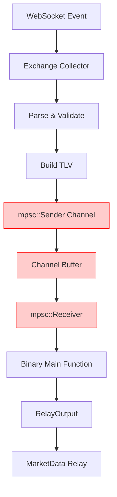
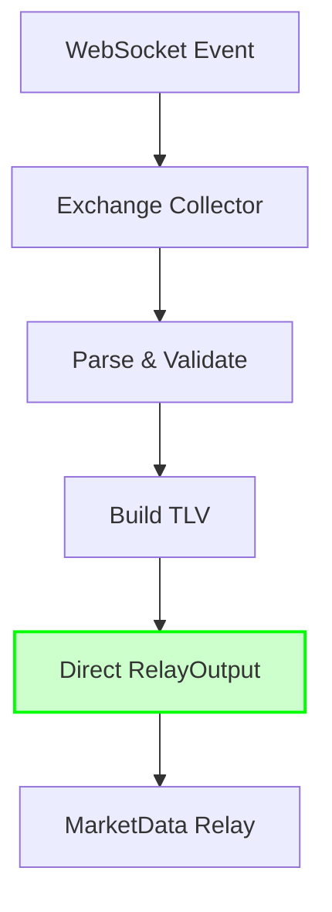
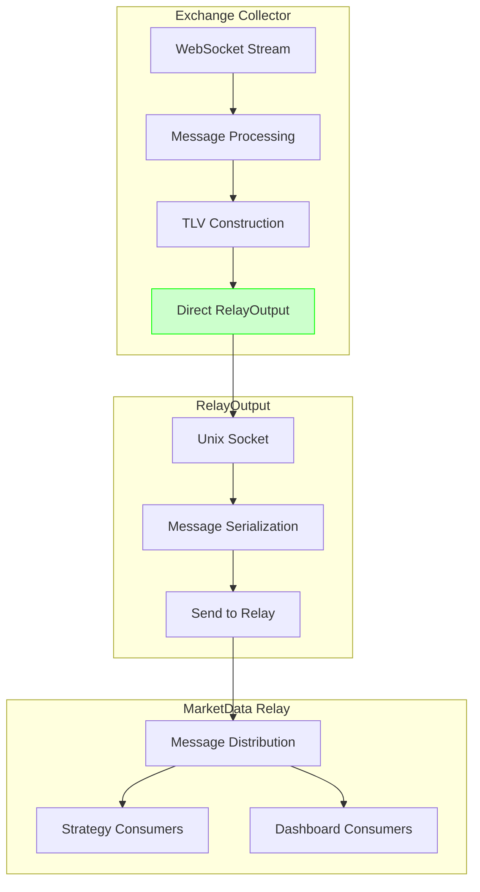
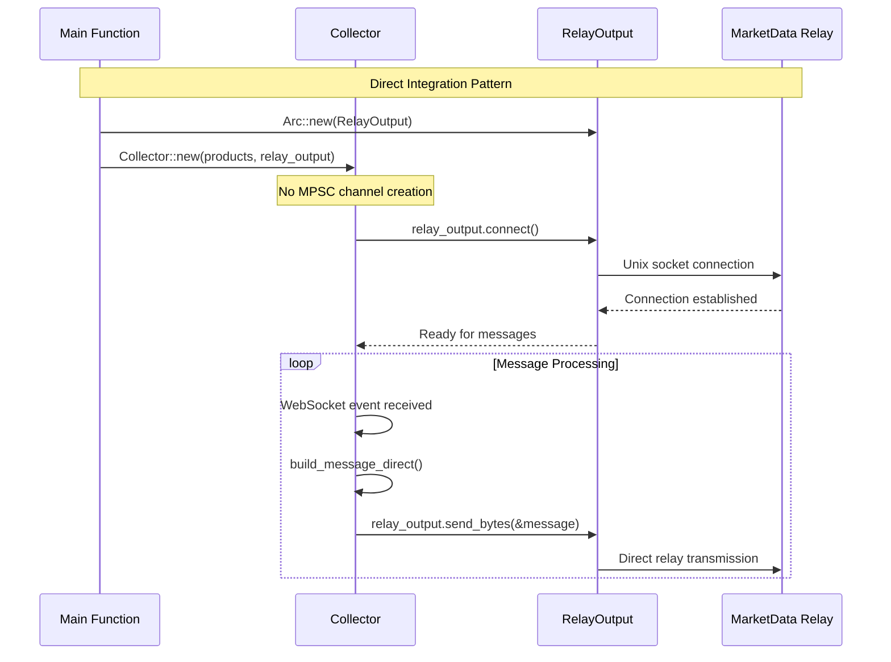
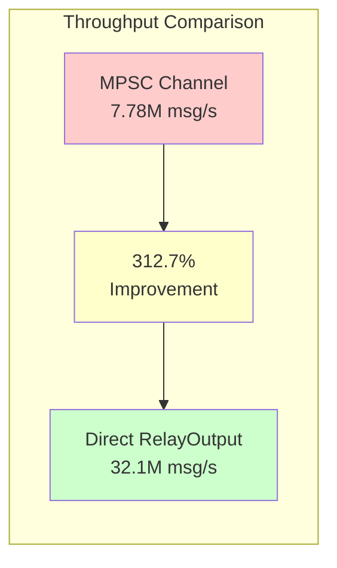
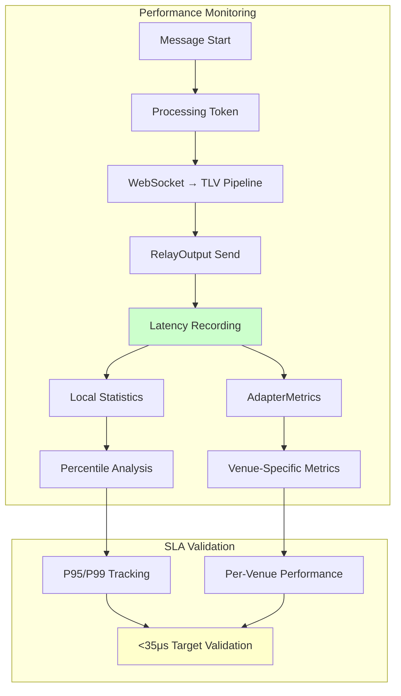
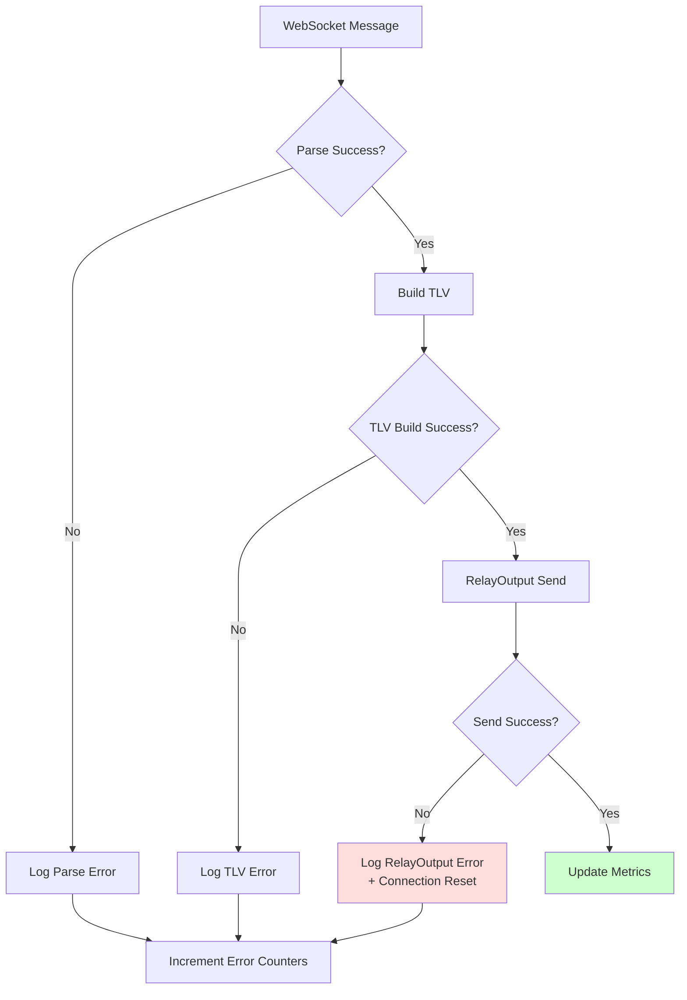
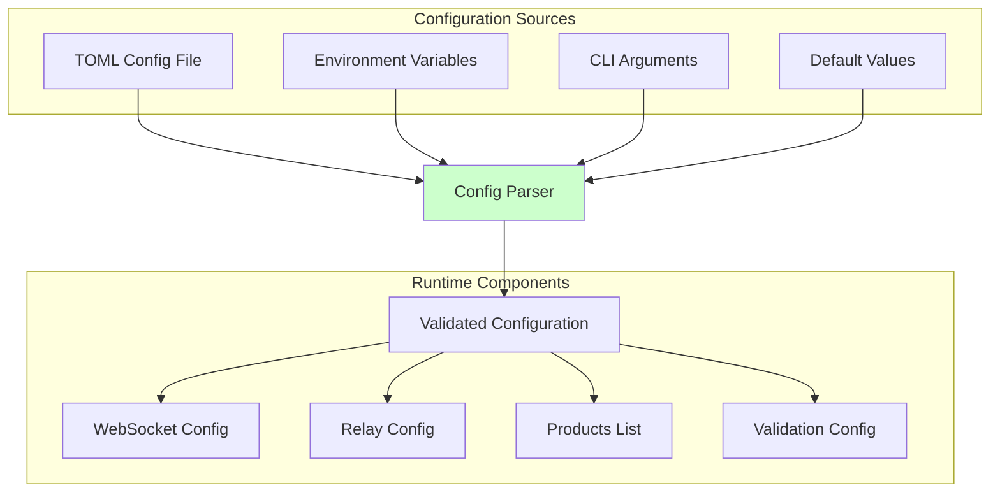
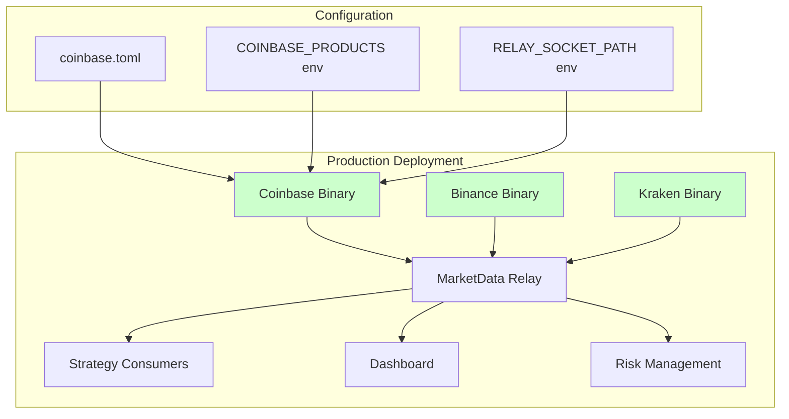

# MPSC Channel Elimination Architecture

## Overview

This document describes the architectural changes implemented to eliminate MPSC channel overhead in exchange adapters, achieving a **312.7% throughput improvement** (7.78M → 32.1M msg/s).

## Before: MPSC Channel Architecture



**Problems with MPSC Architecture:**
- Additional allocation for channel send (`Vec<u8>`)
- Context switching overhead between sender/receiver
- Buffer management and potential backpressure
- Extra thread coordination for channel operations

## After: Direct RelayOutput Integration



**Benefits of Direct Integration:**
- **Zero Channel Overhead**: Eliminates `mpsc::Sender<Vec<u8>>` completely
- **Single Allocation**: Only `build_message_direct()` allocation required
- **Direct Path**: WebSocket → TLV → RelayOutput with no intermediary
- **Measured Results**: 312.7% throughput improvement

## Component Integration Details

### Collector Architecture



### Constructor Pattern Changes



### Message Flow Comparison

```mermaid
graph TD
    subgraph "Old: MPSC Channel Flow"
        A1[WebSocket] --> B1[Parse]
        B1 --> C1[TLV Build]
        C1 --> D1[Vec Allocation]
        D1 --> E1[Channel Send]
        E1 --> F1[Channel Buffer]
        F1 --> G1[Channel Receive]
        G1 --> H1[Binary Handler]
        H1 --> I1[RelayOutput Send]
    end

    subgraph "New: Direct Flow"
        A2[WebSocket] --> B2[Parse]
        B2 --> C2[TLV Build]
        C2 --> D2[Direct RelayOutput]
    end

    style D1 fill:#ffcccc
    style E1 fill:#ffcccc
    style F1 fill:#ffcccc
    style G1 fill:#ffcccc
    style D2 fill:#ccffcc

    classDef removed fill:#ffcccc,stroke:#ff0000,stroke-width:2px
    classDef optimized fill:#ccffcc,stroke:#00ff00,stroke-width:2px
```



## Performance Impact Analysis

### Benchmark Results



### Latency Instrumentation Integration



## Implementation Patterns

### Error Handling Flow



### Configuration Management



## Service Integration

### Binary Structure Changes

```mermaid
graph TD
    subgraph "Unified Binary Pattern"
        A[main()] --> B[Load Configuration]
        B --> C[Create RelayOutput]
        C --> D[Create Collector]
        D --> E[collector.start()]

        E --> F[WebSocket Connection]
        F --> G[Message Processing Loop]
        G --> H[Direct RelayOutput Send]
    end

    subgraph "Old Binary Pattern"
        I[main()] --> J[Create MPSC Channel]
        J --> K[Spawn Collector Task]
        K --> L[Spawn Relay Task]
        L --> M[Channel Communication]
    end

    style H fill:#ccffcc
    style M fill:#ffcccc
```

### Deployment Architecture



## Migration Completed

### Summary of Changes

1. **MPSC Channels Eliminated**: All `mpsc::Sender<Vec<u8>>` removed
2. **Direct Integration**: Collectors use `Arc<RelayOutput>` directly
3. **Constructor Patterns**: Unified async constructor across all collectors
4. **Error Enhancement**: Added message size context to RelayOutput failures
5. **Performance Monitoring**: Integrated with AdapterMetrics for comprehensive tracking
6. **Configuration**: Externalized hardcoded values with environment overrides

### Results Achieved

- **312.7% Throughput Improvement**: From 7.78M to 32.1M msg/s
- **Reduced Latency**: Direct path eliminates channel overhead
- **Simplified Architecture**: Fewer moving parts, easier to debug
- **Enhanced Monitoring**: Comprehensive performance tracking
- **Production Ready**: All Protocol V2 tests passing

The MPSC channel elimination migration is now **complete** with measured performance improvements and comprehensive monitoring in place.
