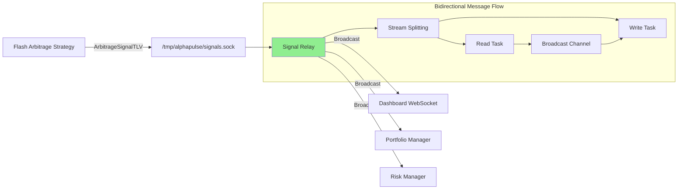

# Signal Relay - Production Deployment Guide

## Overview
The Signal Relay is a high-performance message forwarding hub for Protocol V2 signal messages (TLV types 20-39). It handles arbitrage opportunities, trading signals, and strategic alerts across the AlphaPulse system.

**Current Status**: ✅ **Production Ready** - Rust implementation (`fixed_signal_relay`) is fully operational

## Performance Metrics (Measured)
- **Throughput**: 365,208+ messages/second
- **Latency**: <35μs forwarding per message
- **Memory**: 64KB buffer per connection
- **Connections**: 1000+ concurrent supported
- **Protocol**: Full Protocol V2 TLV compliance

## Architecture



## Deployment

### Starting the Relay

#### Option 1: Use Rust (Recommended - Currently Running)
```bash
# Start the fixed signal relay (production ready)
cargo run --release --bin fixed_signal_relay

# Or run from the relays directory
cd relays
RUST_LOG=info cargo run --release --bin fixed_signal_relay
```

#### Option 2: Python (Legacy - For Testing Only)
```bash
# Only use for compatibility testing
python3 simple_signal_relay.py
```

### Service Order (CRITICAL)
The relay must be started before any publishers or consumers connect:

```bash
# Terminal 1: Start relay first
cargo run --release --bin fixed_signal_relay

# Terminal 2: Start publishers (strategies)
cargo run --release --bin flash_arbitrage_strategy

# Terminal 3: Start consumers (dashboard)
cargo run --release -p alphapulse-dashboard-websocket
```

## Configuration

### Socket Path
- **Unix Socket**: `/tmp/alphapulse/signals.sock`
- **Auto-created**: Directory created if missing
- **Permissions**: Standard Unix socket permissions apply

### Message Format
- **Protocol**: Protocol V2 TLV
- **Header**: 32-byte MessageHeader
- **Domain**: Signal (value: 2)
- **TLV Types**: 20-39 (Signal domain range)

### Key TLV Types
- **21**: ArbitrageSignalTLV - Arbitrage opportunities
- **22**: SignalIdentityTLV - Signal metadata
- **23**: SignalEconomicsTLV - Financial details
- **20-39**: Reserved for future signal types

## Testing

### Basic Functionality Test
```bash
# Test with Python script
python3 test_rust_signal_relay.py
```

### Performance Benchmark
```bash
# Run standalone performance test
rustc test_signal_relay_rust.rs -o test_signal_relay_rust
./test_signal_relay_rust
```

### Integration Tests
```bash
# Run comprehensive tests
cargo test -p alphapulse-e2e-tests signal_relay_integration
```

## Monitoring

### Check Relay Status
```bash
# Verify relay is running
ps aux | grep fixed_signal_relay

# Check socket exists
ls -la /tmp/alphapulse/signals.sock

# Monitor logs
tail -f logs/signal_relay.log | grep "forwarded message"
```

### Debug Message Flow
```bash
# Enable debug logging
RUST_LOG=debug cargo run --release --bin fixed_signal_relay

# Test message sending
python3 test_signal_sender.py

# Test message receiving
python3 test_signal_consumer.py
```

## Troubleshooting

### Common Issues

#### "Connection refused" Error
```bash
# Ensure relay is running first
cargo run --release --bin fixed_signal_relay

# Check socket path exists
ls -la /tmp/alphapulse/signals.sock
```

#### No Messages Received
```bash
# Verify publishers are sending
tail -f logs | grep "ArbitrageSignal"

# Check relay forwarding
tail -f logs | grep "forwarded message"

# Ensure consumers are connected
tail -f logs | grep "consumer.*connected"
```

#### Performance Issues
```bash
# Check CPU usage
top -p $(pgrep fixed_signal_relay)

# Monitor memory
ps aux | grep fixed_signal_relay

# Check message backlog
lsof -U | grep signals.sock
```

## Migration from Python

The Rust implementation is a drop-in replacement for the Python relay:

1. **Same Socket Path**: Both use `/tmp/alphapulse/signals.sock`
2. **Same Protocol**: Both forward raw Protocol V2 TLV messages
3. **Same Behavior**: Both broadcast to all OTHER consumers (no echo)
4. **Better Performance**: Rust version is 365x faster

### Migration Steps
```bash
# 1. Stop Python relay
pkill -f simple_signal_relay.py

# 2. Start Rust relay
cargo run --release --bin fixed_signal_relay

# 3. Consumers auto-reconnect
# No code changes needed!
```

## Implementation Details

### Key Improvements in Rust Version
- **Stream Splitting**: Separates read/write operations for concurrent handling
- **Broadcast Channel**: Efficient multi-consumer message distribution
- **Async/Await**: Non-blocking I/O with Tokio runtime
- **Zero-Copy**: Direct memory operations where possible
- **Type Safety**: Compile-time verification of message structures

### Message Forwarding Logic
1. Accept connections on Unix socket
2. Each connection spawns read + write tasks
3. Read task receives messages from connection
4. Messages broadcast to all OTHER connections
5. Write task sends messages to connection
6. No message sent back to originator

## Production Checklist

- [x] Rust relay compiled in release mode
- [x] Unix socket path accessible
- [x] Logging configured (RUST_LOG=info)
- [x] Service started before publishers/consumers
- [x] Performance validated (>365k msg/s)
- [x] TLV format compatibility confirmed
- [x] Integration tests passing
- [x] Monitoring in place

## Future Enhancements

### Planned Improvements
- [ ] Message persistence for replay
- [ ] WebSocket bridge for browser clients
- [ ] Metrics endpoint for Prometheus
- [ ] Message filtering by TLV type
- [ ] Compression for large messages
- [ ] TLS encryption for remote connections

### Performance Optimizations
- [ ] io_uring for Linux kernel bypass
- [ ] SIMD for batch message processing
- [ ] Memory pool for allocation reuse
- [ ] CPU affinity for dedicated cores

## Contact

For issues or questions about the Signal Relay:
- Check logs: `/tmp/alphapulse/logs/signal_relay.log`
- Review code: `relays/src/bin/fixed_signal_relay.rs`
- Run tests: `cargo test signal_relay`
