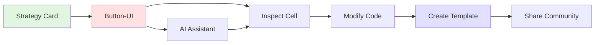

# AlphaPulse UI Architecture & Workflows

## Core Philosophy
AlphaPulse enables progressive complexity disclosure in quantitative trading - users start with button-driven workflows and gradually transition to code-based power users, all within the same platform.

## Page Architecture

### 1. Home Page (News Feed)
**Purpose**: Market awareness and community engagement
- **Data Flow**: 
  - News API → Backend aggregator → Frontend feed
  - User comments → PostgreSQL → Real-time updates via WebSocket
- **Key Features**:
  - Filtered news based on user's active positions
  - Market summary widget with key indices
  - Strategy performance alerts

### 2. Research Page (Strategy Discovery & Development)
**Purpose**: Core value proposition - progressive learning environment
- **Workflow Layers**:
  1. **Discovery Layer**: Grid of strategy cards with performance metrics
  2. **Button-UI Layer**: No-code strategy analysis via pre-built components
  3. **Notebook Layer**: Full Jupyter environment for power users
  4. **Data Layer**: SQL-based data exploration and dataset creation

- **Data Flow**:
  ```
  User Action → Manifest Generation → Cache Check → Compute/Retrieve → Display
  ```
  
- **Manifest Structure** (proposed):
  ```typescript
  interface AnalysisManifest {
    symbol: string | string[];
    timeframe: '1m' | '5m' | '15m' | '1h' | '1d';
    dateRange: { start: Date; end: Date };
    strategy: {
      type: string;
      version: string;
      parameters: Record<string, any>;
    };
    indicators: string[];
    features: string[];
    hash: string; // SHA256 of above for cache key
  }
  ```

- **Caching Strategy**:
  - Signal cache: Pre-computed indicator values (RSI, MACD, etc.)
  - Feature cache: Derived features (rolling stats, patterns)
  - Backtest cache: Full backtest results for parameter combinations
  - TTL: Based on timeframe (1m=1hr, 1d=24hr)

### 3. Develop Page (Power User Environment)
**Purpose**: Full IDE for strategy development and system customization
- **Components**:
  - Monaco editor with Python/TypeScript support
  - File explorer with Git integration
  - Terminal emulator
  - Backtest runner with real-time progress
  - Test suite runner
  
- **API Endpoints**:
  ```
  POST /api/strategies/compile - Validate strategy code
  POST /api/strategies/backtest - Run backtest with manifest
  GET  /api/strategies/results/{id} - Stream backtest results
  POST /api/templates/button-ui - Save custom button-UI
  POST /api/templates/notebook - Save notebook template
  ```

### 4. Monitor Page (Live Trading & Debugging)
**Purpose**: Real-time strategy execution monitoring and debugging
- **Features**:
  - Bar-by-bar replay with event stream
  - Live position tracking
  - Strategy state inspection
  - Performance metrics dashboard
  
- **Data Flow**:
  - NautilusTrader → Event Bus → WebSocket → Frontend
  - Events stored in Parquet files for efficient replay
  
## Backend Integration

### NautilusTrader as Core Engine
NautilusTrader handles all strategy execution, backtesting, and live trading. We simply add caching layers around it:

```python
# Flask API wraps NautilusTrader with caching
from nautilus_trader.backtest.engine import BacktestEngine
from nautilus_trader.model.identifiers import Venue

async def process_manifest(manifest: AnalysisManifest):
    cache_key = manifest.hash
    
    # Check cache layers
    if cached := await redis_client.get(f"backtest:{cache_key}"):
        return cached
    
    # Configure NautilusTrader
    engine = BacktestEngine()
    engine.add_venue(
        venue=Venue(manifest.symbol.split('/')[0]),
        oms_type=OmsType.HEDGING,
        account_type=AccountType.MARGIN,
    )
    
    # Load historical data from Nautilus DataCatalog
    from nautilus_trader.persistence.catalog import ParquetDataCatalog
    catalog = ParquetDataCatalog("./catalog")
    
    # Load data for the requested timeframe
    engine.add_data(
        catalog.quote_ticks(
            instrument_ids=[manifest.symbol],
            start=manifest.dateRange.start,
            end=manifest.dateRange.end
        )
    )
    
    # Run strategy through Nautilus
    engine.add_strategy(strategy=manifest.strategy)
    engine.run()
    
    # Cache and return results
    results = engine.analyzer.get_performance_stats()
    await redis_client.set(f"backtest:{cache_key}", results, ttl=3600)
    return results
```

### API Structure
```typescript
// Frontend service layer
class AlphaPulseAPI {
  async runAnalysis(manifest: AnalysisManifest): Promise<BacktestResult> {
    // Check local IndexedDB cache first
    const cached = await localCache.get(manifest.hash);
    if (cached && !isStale(cached)) return cached;
    
    // Request from backend
    const result = await fetch('/api/analysis/run', {
      method: 'POST',
      body: JSON.stringify(manifest)
    });
    
    // Cache locally
    await localCache.set(manifest.hash, result);
    return result;
  }
}
```

## Data Persistence Layers

### Market Data Storage
1. **NautilusTrader DataCatalog** (Parquet-based):
   - Raw ticks, quotes, trades, order book snapshots
   - Partitioned by `instrument/year/month/day/data_type.parquet`
   - Optimized for chronological replay during backtesting
   - Includes instrument metadata (tick size, lot size, etc.)

### Caching Layers
2. **Hot Cache** (Redis): 
   - Recent computation results (TTL: 1 hour)
   - Live prices and active signals
   - Current manifest processing status

3. **Warm Cache** (PostgreSQL JSONB):
   ```sql
   CREATE TABLE signal_cache (
     manifest_hash VARCHAR(64) PRIMARY KEY,
     manifest JSONB NOT NULL,
     signals JSONB NOT NULL,
     features JSONB NOT NULL,
     backtest_result JSONB,
     created_at TIMESTAMP DEFAULT NOW(),
     accessed_at TIMESTAMP DEFAULT NOW(),
     access_count INT DEFAULT 1
   );
   CREATE INDEX idx_manifest_symbol ON signal_cache((manifest->>'symbol'));
   CREATE INDEX idx_created_at ON signal_cache(created_at);
   ```

4. **Analytics Layer** (DuckDB):
   - For Data Viewer page and exploratory analysis
   - Ad-hoc queries across multiple instruments
   - Aggregations and statistical computations
   - Can query Parquet files directly without loading

5. **User Data** (PostgreSQL):
   - User accounts, strategies, permissions
   - Strategy templates and button-UI definitions
   - Audit logs and usage metrics

### Why This Architecture?
- **NautilusTrader Catalog**: Purpose-built for backtesting, handles corporate actions, splits, etc.
- **PostgreSQL for Cache**: Better for key-value lookups by manifest hash than columnar storage
- **DuckDB for Analytics**: Perfect for the Research page's data exploration features
- **Redis for Speed**: Sub-millisecond response for frequently accessed data
- **Separation of Concerns**: Market data (Parquet) vs results cache (PostgreSQL) vs analytics (DuckDB)

## Progressive User Journey



## Performance Optimizations

1. **Manifest Deduplication**: Hash similar requests, serve from cache
2. **Incremental Computation**: Only compute new data points
3. **Lazy Loading**: Stream results as computed
4. **WebWorker Processing**: Heavy computations off main thread
5. **Virtual Scrolling**: Handle large datasets in UI

## Security Considerations

- Strategy code sandboxing via Docker containers
- Rate limiting on backtest requests
- User quotas based on subscription tier
- Isolated execution environments per user