# AlphaPulse DeFi System Architecture

## System Overview

```mermaid
graph TD
    %% Data Sources
    subgraph "Data Sources"
        PolygonWS[Polygon DEX Data]
        UniswapV3[Uniswap V3]
        SushiSwap[SushiSwap]
        QuickSwap[QuickSwap]
        Curve[Curve Finance]
        AnkrMempool[Ankr Mempool WebSocket]
        AaveOracle[Aave Price Oracle]
    end
    
    %% Hot Path Processing
    subgraph "Hot Path 5-35μs latency"
        subgraph "Data Collectors Rust"
            PolygonCollector[Polygon/DEX Collector]
            MempoolCollector[Mempool Monitor]
        end
        
        EnhancedRelay[Enhanced Relay Server Fan-out + DeFi Routing]
        
        subgraph "DeFi Detection Engine"
            OpportunityDetector[Opportunity Detector Cross-DEX Scanner]
            MevAnalyzer[MEV Analyzer Predictive Models]
            LiquidationHunter[Liquidation Hunter Position Monitor]
        end
        
        subgraph "DeFi Execution Systems"
            CapitalArbitrage[Capital Arbitrage Agent Direct DEX Trading]
            FlashLoanEngine[Flash Loan Engine Aave V3 Integration]
        end
    end
    
    %% DeFi Protocols
    subgraph "DeFi Protocols"
        AaveV3[Aave V3 Flash Loans]
        UniswapRouters[Uniswap Routers V2 & V3]
        SushiRouters[SushiSwap Routers]
        CurveExchange[Curve Exchange]
    end
    
    %% MEV Execution Layer
    subgraph "MEV Execution Layer"
        MevRelay[MEV Execution Relay Cost-Optimized Routing]
    end
    
    %% Smart Contracts
    subgraph "Smart Contracts Polygon"
        HuffContract[Ultra-Efficient Huff Contract 345k gas]
        FlashLoanContract[Flash Loan Arbitrage Contract]
        LiquidationContract[Liquidation Bot Contract]
        StandardContract[Standard Solidity Contract Fallback]
    end
    
    %% Storage
    subgraph "Hot Path Storage"
        TimescaleDB[TimescaleDB Market + DeFi Data]
        Redis[Redis Cache + Mempool Data]
        ArbitrageOps[arbitrage_opportunities]
        ExecutionResults[execution_results]
        MempoolData[mempool_transactions]
    end
    
    %% Data Ingestion Flow
    PolygonWS --> PolygonCollector
    UniswapV3 --> PolygonCollector
    SushiSwap --> PolygonCollector
    QuickSwap --> PolygonCollector
    Curve --> PolygonCollector
    AnkrMempool --> MempoolCollector
    AaveOracle --> MempoolCollector
    
    %% Hot Path Data Flow
    PolygonCollector --> EnhancedRelay
    MempoolCollector --> EnhancedRelay
    
    EnhancedRelay --> OpportunityDetector
    EnhancedRelay --> MevAnalyzer
    EnhancedRelay --> LiquidationHunter
    
    %% DeFi Opportunity Detection
    OpportunityDetector --> CapitalArbitrage
    OpportunityDetector --> FlashLoanEngine
    MevAnalyzer --> CapitalArbitrage
    MevAnalyzer --> FlashLoanEngine
    LiquidationHunter --> FlashLoanEngine
    
    %% DeFi Execution Paths via MEV Relay
    CapitalArbitrage --> MevRelay
    FlashLoanEngine --> MevRelay
    LiquidationHunter --> MevRelay
    
    %% MEV Relay Routes to Optimal Contracts
    MevRelay --> HuffContract
    MevRelay --> FlashLoanContract
    MevRelay --> LiquidationContract
    MevRelay --> StandardContract
    
    %% Contract Execution Paths
    HuffContract --> UniswapRouters
    HuffContract --> SushiRouters
    HuffContract --> CurveExchange
    
    FlashLoanContract --> AaveV3
    FlashLoanContract --> UniswapRouters
    FlashLoanContract --> SushiRouters
    FlashLoanContract --> CurveExchange
    
    LiquidationContract --> AaveV3
    LiquidationContract --> UniswapRouters
    
    StandardContract --> UniswapRouters
    StandardContract --> SushiRouters
    StandardContract --> CurveExchange
    
    %% Hot Path Storage
    EnhancedRelay --> TimescaleDB
    EnhancedRelay --> Redis
    MevRelay --> ArbitrageOps
    MevRelay --> ExecutionResults
    MempoolCollector --> MempoolData
    
    %% Styling
    classDef hotPath fill:#ff6b6b,stroke:#d63031,stroke-width:3px,color:#fff
    classDef defi fill:#00b894,stroke:#00a085,stroke-width:3px,color:#fff
    classDef mevRelay fill:#6c5ce7,stroke:#5f3dc4,stroke-width:3px,color:#fff
    classDef contracts fill:#fdcb6e,stroke:#e17055,stroke-width:2px,color:#333
    classDef huffContract fill:#00cec9,stroke:#00b894,stroke-width:3px,color:#fff
    classDef external fill:#fd79a8,stroke:#e84393,stroke-width:2px,color:#fff
    classDef storage fill:#55a3ff,stroke:#2d3436,stroke-width:2px,color:#fff
    
    class PolygonCollector,MempoolCollector,EnhancedRelay hotPath
    class OpportunityDetector,MevAnalyzer,LiquidationHunter,CapitalArbitrage,FlashLoanEngine defi
    class MevRelay mevRelay
    class FlashLoanContract,LiquidationContract,StandardContract contracts
    class HuffContract huffContract
    class PolygonWS,UniswapV3,SushiSwap,QuickSwap,Curve,AnkrMempool,AaveOracle,AaveV3,UniswapRouters,SushiRouters,CurveExchange external
    class TimescaleDB,Redis,ArbitrageOps,ExecutionResults,MempoolData storage
```



## Component Details

### Data Collection Layer
- **Polygon Collector**: Real-time DEX event monitoring
- **Mempool Collector**: Pending transaction analysis for MEV

### Detection Engine
- **Opportunity Detector**: Cross-DEX price discrepancy scanner
- **MEV Analyzer**: Sandwich attack and frontrun detection
- **Liquidation Hunter**: Monitors under-collateralized positions

### Execution Systems
- **Capital Arbitrage**: Uses wallet funds for simple arbitrage
- **Flash Loan Engine**: Leverages Aave V3 for capital-free arbitrage

### MEV Execution Layer
- **MEV Execution Relay**: Intelligent contract routing for cost optimization
  - Analyzes gas costs across all available contracts
  - Routes to cheapest execution path per opportunity
  - Supports multiple contract types simultaneously
  - Real-time gas price monitoring and optimization

### Smart Contracts
- **Huff Contract**: Ultra-efficient execution at 345k gas (~$0.008)
- **Flash Loan Contract**: Handles multi-hop arbitrage atomically
- **Liquidation Contract**: Executes liquidations with flash loans
- **Standard Contract**: Solidity fallback for complex operations

## Latency Targets

- **Data Collection**: < 5μs from event to collector
- **Opportunity Detection**: < 10μs analysis time
- **Execution Decision**: < 20μs total latency
- **Transaction Submission**: < 35μs end-to-end

## MEV Relay Routing Logic

The MEV Execution Relay dynamically selects the optimal contract for each arbitrage opportunity:

### Contract Selection Criteria
1. **Gas Cost Analysis**:
   - Huff Contract: 345k gas (~$0.008) - preferred for simple arbitrage
   - Standard Contract: 400-500k gas (~$0.012-0.015) - complex operations
   - Flash Loan Contract: 478k+ gas (~$0.011+) - capital-free arbitrage

2. **Opportunity Type Matching**:
   - **Simple V2 Arbitrage** → Huff Contract (maximum efficiency)
   - **Complex Multi-hop** → Standard Contract (full feature support)
   - **Capital-free Trades** → Flash Loan Contract (Aave integration)
   - **Liquidations** → Liquidation Contract (specialized logic)

3. **Real-time Decision Matrix**:
   ```
   IF profit_margin > gas_cost_difference + safety_buffer:
       USE most_efficient_contract
   ELSE:
       USE most_capable_contract
   ```

### Routing Examples
- **$50 profit, 0.1% spread** → Huff Contract (save $0.004 gas, 99.7% of profit retained)
- **$15 profit, 0.3% spread** → Standard Contract (safety over efficiency)
- **Large opportunity, no capital** → Flash Loan Contract (enable execution)

## Integration Points

### Existing AlphaPulse Infrastructure
1. **Exchange Collector** → Extended for DEX events
2. **Relay Server** → Enhanced with DeFi routing
3. **TimescaleDB** → Stores arbitrage opportunities
4. **Unix Sockets** → Ultra-low latency IPC

### New DeFi Components
1. **MEV Execution Relay** → Intelligent contract routing
2. **Flash Loan Contracts** → Deployed on Polygon
3. **Huff Contracts** → Ultra-efficient execution
4. **MEV Protection** → Flashbots integration
5. **Liquidation Engine** → Aave position monitoring
6. **Compound Arbitrage** → 10+ token path discovery