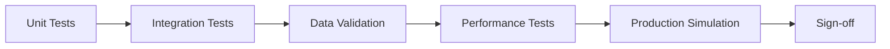

# Standardized Testing Pipeline for New Integrations

## Comprehensive Testing Framework for Exchange/DEX Integration

This document defines the mandatory testing pipeline that every new integration must pass before deployment.

## Testing Stages Overview



## Stage 1: Unit Testing Suite

### 1.1 Parser Tests
```rust
// tests/unit/test_parser.rs
use super::*;
use test_case::test_case;

#[test_case("12345.67890", 1234567890000; "standard decimal")]
#[test_case("1.23e-5", 1230; "scientific notation")]
#[test_case("0.00000001", 1; "minimum value")]
#[test_case("999999.99999999", 99999999999999; "maximum value")]
fn test_price_parsing(input: &str, expected: i64) {
    let parser = ExchangeParser::new();
    let result = parser.parse_price(input).unwrap();
    assert_eq!(result, expected);
}

#[test_case("1698765432123", 1698765432123000000; "milliseconds")]
#[test_case("1698765432", 1698765432000000000; "seconds")]
#[test_case("2024-01-15T10:30:45.123Z", 1705316445123000000; "ISO8601")]
fn test_timestamp_parsing(input: &str, expected: u64) {
    let parser = ExchangeParser::new();
    let result = parser.parse_timestamp(input).unwrap();
    assert_eq!(result, expected);
}

#[test]
fn test_null_field_handling() {
    let test_cases = vec![
        json!({"price": null, "volume": "100"}),
        json!({"price": "100", "volume": null}),
        json!({}),  // Missing fields
    ];
    
    let parser = ExchangeParser::new();
    
    for case in test_cases {
        let result = parser.parse_message(&case);
        assert!(result.is_ok() || result.is_err());
        // Should handle gracefully, not panic
    }
}
```

### 1.2 Normalizer Tests
```python
# tests/unit/test_normalizer.py
import pytest
from decimal import Decimal
import hypothesis.strategies as st
from hypothesis import given, settings

class TestNormalizer:
    @pytest.mark.parametrize("input_val,expected", [
        ("buy", "buy"),
        ("sell", "sell"),
        ("b", "buy"),
        ("s", "sell"),
        ("BUY", "buy"),
        ("SELL", "sell"),
        ("0", "buy"),  # Some exchanges use 0/1
        ("1", "sell"),
    ])
    def test_side_normalization(self, input_val, expected):
        normalizer = ExchangeNormalizer()
        assert normalizer.normalize_side(input_val) == expected
    
    @given(
        price=st.decimals(min_value=Decimal("0.00000001"), 
                         max_value=Decimal("999999.99999999"),
                         places=8)
    )
    @settings(max_examples=1000)
    def test_price_precision_preserved(self, price):
        """Property test: price precision must be preserved"""
        normalizer = ExchangeNormalizer()
        
        # Convert to our format and back
        normalized = normalizer.normalize_price(str(price))
        denormalized = normalizer.denormalize_price(normalized)
        
        # Check precision preserved to 8 decimal places
        assert abs(Decimal(denormalized) - price) < Decimal("0.00000001")
    
    def test_symbol_normalization(self):
        test_cases = [
            ("BTC-USD", "BTC-USD"),
            ("BTCUSD", "BTC-USD"),
            ("BTC/USD", "BTC-USD"),
            ("BTC_USD", "BTC-USD"),
            ("btc-usd", "BTC-USD"),
            ("XBT-USD", "BTC-USD"),  # Some use XBT for Bitcoin
        ]
        
        normalizer = ExchangeNormalizer()
        for input_val, expected in test_cases:
            assert normalizer.normalize_symbol(input_val) == expected
```

## Stage 2: Integration Testing

### 2.1 Message Flow Tests
```rust
// tests/integration/test_message_flow.rs
#[tokio::test]
async fn test_end_to_end_message_flow() {
    // Setup test infrastructure
    let collector = TestCollector::new();
    let relay = TestRelay::new();
    let bridge = TestBridge::new();
    
    // Connect components
    collector.connect_to_relay(&relay).await.unwrap();
    relay.connect_to_bridge(&bridge).await.unwrap();
    
    // Inject test message at collector
    let test_trade = json!({
        "price": "50000.50",
        "volume": "0.1",
        "timestamp": "1698765432123",
        "side": "buy"
    });
    
    collector.inject_message(test_trade.clone()).await;
    
    // Wait for propagation
    tokio::time::sleep(Duration::from_millis(100)).await;
    
    // Verify at each hop
    let relay_msg = relay.get_last_message().await.unwrap();
    assert_eq!(relay_msg.len(), 48);  // Binary protocol size
    
    let bridge_msg = bridge.get_last_message().await.unwrap();
    assert_eq!(bridge_msg["price"], 50000.50);
    assert_eq!(bridge_msg["volume"], 0.1);
}

#[tokio::test]
async fn test_concurrent_message_handling() {
    let collector = TestCollector::new();
    
    // Send 1000 messages concurrently
    let mut handles = vec![];
    
    for i in 0..1000 {
        let collector_clone = collector.clone();
        let handle = tokio::spawn(async move {
            let msg = create_test_message(i);
            collector_clone.process_message(msg).await
        });
        handles.push(handle);
    }
    
    // Wait for all to complete
    let results: Vec<_> = futures::future::join_all(handles).await;
    
    // All should succeed
    for result in results {
        assert!(result.unwrap().is_ok());
    }
    
    // Verify message ordering preserved
    let messages = collector.get_all_messages().await;
    verify_message_ordering(&messages);
}
```

### 2.2 WebSocket Stability Tests
```python
# tests/integration/test_websocket_stability.py
import asyncio
import pytest
import websockets
from unittest.mock import AsyncMock

class TestWebSocketStability:
    @pytest.mark.asyncio
    async def test_reconnection_logic(self):
        """Test automatic reconnection on disconnect"""
        monitor = ExchangeMonitor()
        
        # Connect initially
        await monitor.connect()
        assert monitor.is_connected()
        
        # Simulate disconnect
        await monitor.ws.close()
        
        # Wait for auto-reconnect
        await asyncio.sleep(2)
        assert monitor.is_connected()
        
        # Verify can still receive messages
        msg = await monitor.receive_message()
        assert msg is not None
    
    @pytest.mark.asyncio
    async def test_heartbeat_handling(self):
        """Test ping/pong heartbeat"""
        monitor = ExchangeMonitor()
        await monitor.connect()
        
        # Run for 65 seconds (> heartbeat interval)
        start = time.time()
        disconnects = 0
        
        while time.time() - start < 65:
            if not monitor.is_connected():
                disconnects += 1
            await asyncio.sleep(1)
        
        # Should maintain connection
        assert disconnects == 0
        assert monitor.heartbeat_count > 2
    
    @pytest.mark.asyncio
    async def test_message_buffer_overflow(self):
        """Test handling of rapid message bursts"""
        monitor = ExchangeMonitor(buffer_size=100)
        
        # Send 1000 messages rapidly
        for i in range(1000):
            await monitor.inject_test_message(f"msg_{i}")
        
        # Should handle gracefully without memory issues
        assert monitor.messages_dropped == 900  # Buffer overflow
        assert len(monitor.buffer) == 100
        
        # Can still process new messages
        await monitor.inject_test_message("final")
        assert monitor.is_healthy()
```

## Stage 3: Data Validation Suite

### 3.1 Binary Protocol Validation
```rust
// tests/data_validation/test_binary_protocol.rs
use proptest::prelude::*;

proptest! {
    #[test]
    fn test_binary_protocol_roundtrip(
        price in 1i64..=999999999999i64,
        volume in 1i64..=999999999999i64,
        timestamp in 1u64..=u64::MAX,
        side in prop::bool::ANY
    ) {
        let original = TradeMessage {
            price,
            volume,
            timestamp_ns: timestamp,
            side: if side { Side::Buy } else { Side::Sell },
            symbol_hash: 12345,
        };
        
        // Convert to binary
        let binary = original.to_bytes();
        assert_eq!(binary.len(), 48);
        
        // Convert back
        let restored = TradeMessage::from_bytes(&binary).unwrap();
        
        // Must be identical
        assert_eq!(original, restored);
    }
}

#[test]
fn test_precision_edge_cases() {
    let edge_cases = vec![
        0.00000001_f64,
        0.123456789_f64,
        12345.6789_f64,
        999999.99999999_f64,
    ];
    
    for original in edge_cases {
        // Convert to fixed-point
        let fixed = (original * 1e8) as i64;
        
        // Store in binary message
        let msg = TradeMessage {
            price: fixed,
            volume: fixed,
            timestamp_ns: 0,
            side: Side::Buy,
            symbol_hash: 0,
        };
        
        let binary = msg.to_bytes();
        let restored = TradeMessage::from_bytes(&binary).unwrap();
        
        // Convert back to float
        let restored_float = restored.price as f64 / 1e8;
        
        // Check precision (allowing for floating point errors)
        let error = (original - restored_float).abs();
        assert!(error < 1e-8, "Precision lost: {} != {}", original, restored_float);
    }
}
```

### 3.2 Exchange-Specific Validation
```python
# tests/data_validation/test_exchange_specific.py
import pytest
from decimal import Decimal

class TestExchangeSpecificValidation:
    def test_kraken_array_format(self):
        """Kraken uses arrays: [price, volume, timestamp]"""
        kraken_msg = ["50000.50", "0.1", 1698765432.123]
        
        parser = KrakenParser()
        result = parser.parse_trade(kraken_msg)
        
        assert result['price'] == Decimal("50000.50")
        assert result['volume'] == Decimal("0.1")
        assert result['timestamp_ns'] == 1698765432123000000
    
    def test_coinbase_string_prices(self):
        """Coinbase uses string prices with variable decimals"""
        test_cases = [
            "50000",      # No decimals
            "50000.5",    # 1 decimal
            "50000.50",   # 2 decimals
            "0.00000001", # 8 decimals
        ]
        
        parser = CoinbaseParser()
        for price_str in test_cases:
            result = parser.parse_price(price_str)
            # Should preserve exact precision
            assert str(result) == price_str.rstrip('0').rstrip('.')
    
    def test_uniswap_wei_conversion(self):
        """Uniswap uses Wei (18 decimals)"""
        wei_amount = 1000000000000000000  # 1 token
        
        parser = UniswapParser()
        decimal_amount = parser.wei_to_decimal(wei_amount, decimals=18)
        
        assert decimal_amount == Decimal("1")
        
        # Test USDC (6 decimals)
        usdc_amount = 1000000  # 1 USDC
        decimal_usdc = parser.wei_to_decimal(usdc_amount, decimals=6)
        assert decimal_usdc == Decimal("1")
```

## Stage 4: Performance Testing

### 4.1 Latency Benchmarks
```rust
// tests/performance/bench_latency.rs
use criterion::{black_box, criterion_group, criterion_main, Criterion};

fn benchmark_message_processing(c: &mut Criterion) {
    let mut group = c.benchmark_group("message_processing");
    
    // Test different message sizes
    for size in [10, 100, 1000, 10000].iter() {
        group.bench_function(format!("parse_{}_messages", size), |b| {
            let messages = generate_test_messages(*size);
            let parser = ExchangeParser::new();
            
            b.iter(|| {
                for msg in &messages {
                    parser.parse_message(black_box(msg));
                }
            });
        });
    }
    
    group.finish();
}

fn benchmark_binary_conversion(c: &mut Criterion) {
    c.bench_function("binary_protocol_conversion", |b| {
        let trade = create_test_trade();
        
        b.iter(|| {
            let binary = trade.to_bytes();
            let _ = TradeMessage::from_bytes(black_box(&binary));
        });
    });
}

criterion_group!(benches, benchmark_message_processing, benchmark_binary_conversion);
criterion_main!(benches);
```

### 4.2 Throughput Tests
```python
# tests/performance/test_throughput.py
import asyncio
import time
from statistics import mean, stdev

class TestThroughput:
    async def test_sustained_throughput(self):
        """Test sustained message processing rate"""
        processor = MessageProcessor()
        
        # Warm up
        for _ in range(1000):
            await processor.process(create_test_message())
        
        # Measure throughput over 60 seconds
        start = time.perf_counter()
        count = 0
        
        while time.perf_counter() - start < 60:
            await processor.process(create_test_message())
            count += 1
        
        throughput = count / 60
        print(f"Throughput: {throughput:.2f} msg/sec")
        
        # Must exceed minimum requirement
        assert throughput > 10000, f"Throughput {throughput} below 10k msg/sec"
    
    async def test_burst_handling(self):
        """Test handling of traffic bursts"""
        processor = MessageProcessor()
        
        # Send burst of 10k messages
        start = time.perf_counter()
        
        tasks = []
        for _ in range(10000):
            tasks.append(processor.process(create_test_message()))
        
        await asyncio.gather(*tasks)
        
        duration = time.perf_counter() - start
        rate = 10000 / duration
        
        print(f"Burst rate: {rate:.2f} msg/sec")
        assert rate > 50000, "Cannot handle burst traffic"
```

## Stage 5: Production Simulation

### 5.1 Live Data Replay
```python
# tests/production/test_replay.py
import json
from pathlib import Path

class TestProductionReplay:
    def load_production_data(self):
        """Load captured production data"""
        data_file = Path("tests/fixtures/production_capture.json")
        with open(data_file) as f:
            return json.load(f)
    
    async def test_replay_production_day(self):
        """Replay full day of production data"""
        data = self.load_production_data()
        processor = MessageProcessor()
        
        errors = []
        processed = 0
        
        for message in data['messages']:
            try:
                result = await processor.process(message)
                processed += 1
                
                # Validate result
                assert result is not None
                assert 'price' in result
                assert 'volume' in result
                
            except Exception as e:
                errors.append({
                    'message': message,
                    'error': str(e)
                })
        
        # Calculate success rate
        success_rate = processed / len(data['messages']) * 100
        
        print(f"Processed: {processed}/{len(data['messages'])}")
        print(f"Success rate: {success_rate:.2f}%")
        print(f"Errors: {len(errors)}")
        
        # Must handle 99.9% of messages
        assert success_rate > 99.9
        
        # Analyze errors
        if errors:
            self.analyze_errors(errors)
    
    def analyze_errors(self, errors):
        """Analyze error patterns"""
        error_types = {}
        
        for err in errors:
            error_type = type(err['error']).__name__
            error_types[error_type] = error_types.get(error_type, 0) + 1
        
        print("Error breakdown:")
        for err_type, count in error_types.items():
            print(f"  {err_type}: {count}")
```

### 5.2 Chaos Testing
```python
# tests/production/test_chaos.py
import random
import asyncio

class TestChaosEngineering:
    async def test_random_disconnects(self):
        """Test resilience to random disconnections"""
        monitor = ExchangeMonitor()
        messages_received = []
        
        async def receive_loop():
            while True:
                try:
                    msg = await monitor.receive_message()
                    messages_received.append(msg)
                except:
                    pass
        
        # Start receiving
        task = asyncio.create_task(receive_loop())
        
        # Random disconnects for 5 minutes
        for _ in range(10):
            await asyncio.sleep(random.uniform(10, 30))
            
            # Disconnect
            await monitor.disconnect()
            await asyncio.sleep(random.uniform(1, 5))
            
            # Should auto-reconnect
            assert monitor.is_connected()
        
        task.cancel()
        
        # Should have received messages despite disconnects
        assert len(messages_received) > 0
    
    async def test_malformed_messages(self):
        """Test handling of malformed data"""
        parser = MessageParser()
        
        malformed = [
            "not json",
            "{'invalid': json}",
            json.dumps({"price": "not_a_number"}),
            json.dumps({"price": None}),
            json.dumps({}),  # Empty
            json.dumps({"price": -1}),  # Negative
            json.dumps({"price": float('inf')}),  # Infinity
            json.dumps({"price": float('nan')}),  # NaN
        ]
        
        for msg in malformed:
            result = parser.parse(msg)
            # Should handle gracefully
            assert result is None or isinstance(result, dict)
```

## Stage 6: Automated Test Execution

### 6.1 Test Pipeline Configuration
```yaml
# .github/workflows/integration_tests.yml
name: Integration Testing Pipeline

on:
  pull_request:
    paths:
      - 'exchanges/**'
      - 'protocol/**'

jobs:
  unit-tests:
    runs-on: ubuntu-latest
    steps:
      - uses: actions/checkout@v3
      
      - name: Run Rust Unit Tests
        run: |
          cargo test --workspace --lib
          
      - name: Run Python Unit Tests
        run: |
          pytest tests/unit/ -v --cov=exchanges --cov-report=xml
          
      - name: Upload Coverage
        uses: codecov/codecov-action@v3
        
  integration-tests:
    runs-on: ubuntu-latest
    needs: unit-tests
    steps:
      - name: Setup Test Environment
        run: |
          docker-compose -f tests/docker-compose.yml up -d
          
      - name: Run Integration Tests
        run: |
          cargo test --workspace --test '*'
          pytest tests/integration/ -v
          
  performance-tests:
    runs-on: ubuntu-latest
    needs: integration-tests
    steps:
      - name: Run Benchmarks
        run: |
          cargo bench --workspace
          
      - name: Check Performance Regression
        run: |
          python scripts/check_performance.py
          
  data-validation:
    runs-on: ubuntu-latest
    needs: integration-tests
    steps:
      - name: Run Data Validation
        run: |
          pytest tests/data_validation/ -v
          
      - name: Binary Protocol Tests
        run: |
          cargo test --package protocol --test '*'
          
  production-simulation:
    runs-on: ubuntu-latest
    needs: [performance-tests, data-validation]
    steps:
      - name: Replay Production Data
        run: |
          pytest tests/production/test_replay.py -v
          
      - name: Chaos Testing
        run: |
          pytest tests/production/test_chaos.py -v
```

### 6.2 Test Report Generator
```python
# scripts/generate_test_report.py
import json
from pathlib import Path
from datetime import datetime

class TestReportGenerator:
    def generate_report(self, exchange_name: str) -> None:
        """Generate comprehensive test report"""
        
        results = self.collect_test_results()
        
        report = f"""# Test Report: {exchange_name}
Generated: {datetime.now().isoformat()}

## Test Summary

| Stage | Tests | Passed | Failed | Coverage |
|-------|-------|--------|--------|----------|
| Unit Tests | {results['unit']['total']} | {results['unit']['passed']} | {results['unit']['failed']} | {results['unit']['coverage']}% |
| Integration | {results['integration']['total']} | {results['integration']['passed']} | {results['integration']['failed']} | N/A |
| Data Validation | {results['validation']['total']} | {results['validation']['passed']} | {results['validation']['failed']} | N/A |
| Performance | {results['performance']['total']} | {results['performance']['passed']} | {results['performance']['failed']} | N/A |

## Performance Metrics

- **Message Processing Latency**: {results['latency']}μs (p99)
- **Throughput**: {results['throughput']:,} msg/sec
- **Memory Usage**: {results['memory']}MB
- **Binary Protocol Size**: 48 bytes ✓

## Data Validation Results

- **Precision Tests**: {results['precision_status']}
- **Exchange Format**: {results['format_status']}
- **Null Handling**: {results['null_status']}
- **Edge Cases**: {results['edge_status']}

## Production Readiness

{self.generate_checklist(results)}

## Sign-off

- [ ] Engineering Review
- [ ] QA Validation
- [ ] Security Audit
- [ ] Performance Approved
- [ ] Documentation Complete

## Recommendations

{self.generate_recommendations(results)}
"""
        
        # Save report
        report_path = Path(f"exchanges/{exchange_name}/test_report.md")
        report_path.write_text(report)
        
        print(f"Report generated: {report_path}")
    
    def generate_checklist(self, results):
        items = []
        
        if results['unit']['coverage'] >= 90:
            items.append("✅ Unit test coverage >90%")
        else:
            items.append("❌ Unit test coverage <90%")
            
        if results['latency'] < 100:
            items.append("✅ Latency <100μs")
        else:
            items.append("❌ Latency >100μs")
            
        if results['throughput'] > 10000:
            items.append("✅ Throughput >10k msg/sec")
        else:
            items.append("❌ Throughput <10k msg/sec")
            
        if results['precision_status'] == "PASS":
            items.append("✅ No precision loss")
        else:
            items.append("❌ Precision issues detected")
            
        return "\n".join(items)
```

## Quality Gates

### Mandatory Pass Criteria
1. **Unit Tests**: 100% pass rate, >90% coverage
2. **Integration Tests**: 100% pass rate
3. **Data Validation**: Zero precision loss
4. **Performance**: <100μs latency, >10k msg/sec
5. **Production Replay**: >99.9% success rate
6. **Chaos Testing**: No data loss during failures

### Automated Enforcement
```bash
# scripts/check_quality_gates.sh
#!/bin/bash

EXCHANGE=$1

# Run all tests
make test-all EXCHANGE=$EXCHANGE

# Check results
if [ -f "test_results.json" ]; then
    python scripts/check_quality_gates.py test_results.json
    
    if [ $? -ne 0 ]; then
        echo "❌ Quality gates failed!"
        exit 1
    fi
    
    echo "✅ All quality gates passed!"
else
    echo "❌ Test results not found!"
    exit 1
fi
```

This comprehensive testing pipeline ensures every integration meets our high standards for accuracy, performance, and reliability.